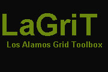

{width="420" height="120"}
{width="180" height="120"}
[]{#content}\
**LaGriT (Los Alamos Grid Toolbox) LA-CC-15-069** is a library of user
callable tools that provide mesh generation, mesh optimization and
dynamic mesh maintenance in two and three dimensions. LaGriT is used for
a variety of geology and geophysics modeling applications including
porous flow and transport model construction, finite element modeling of
stress/strain in crustal fault systems, seismology, discrete fracture
networks, asteroids and hydrothermal systems. The general capabilities
of LaGriT can also be used outside of earth science applications and
applied to nearly any system that requires a grid/mesh and initial and
boundary conditions, setting of material properties and other model
setup functions. It can also be use as a tool to pre- and post-process
and analyze vertex and mesh based data.

Geometric regions for LaGriT are defined as combinations of bounding
surfaces, where the surfaces are described analytically or as
tessellated surfaces (triangles and/or quadrilaterals). A variety of
techniques for distributing points within these geometric regions are
provided. Mesh connectivity uses a Delaunay tetrahedralization algorithm
that respects material interfaces. The data structures created to
implement this algorithm are compact and powerful and expandable to
include hybrid meshes (tet, hex, prism, pyramid, quadrilateral,
triangle, line) however the main algorithms are for triangle and
tetrahedral Delaunay meshes.

Mesh refinement, derefinement and smoothing are available to modify the
mesh to provide more resolution in areas of interest. Mesh refinement
adds nodes to the mesh based on geometric criteria such as edge length
or based on field variable shape. Mesh smoothing moves nodes to adapt
the mesh to field variable measures, and, at the same time, maintains
quality elements.

LaGriT has three modes of use, 1) command line 2) batch driven via a
control file 3) calls from C/Fortran programs. There is no GUI
interface.

\
**PyLaGriT** is a Python interface that allows LaGriT functionality to
be used interactively and in batch mode. It combines the meshing
capabilities of LaGriT with the numeric and scientific functionality of
Python including the quering of mesh properties, enhanced looping
functionality, and user defined error checking. PyLaGriT has been
developed to easily generate meshes by extrusion, dimensional reduction,
coarsening and refinement of synthetic and realistic data. PyLaGriT
enhances the workflow, enabling rapid iterations for use in simulations
incorporating uncertainty in system geometry and automatic mesh
generation. See Description and Manual at
[lanl.github.io/LaGriT](https://lanl.github.io/LaGriT/)\
\

LaGriT and PyLaGriT are now distributed as open-source software under a
BSD 3-Clause License (See
[License](https://lagrit.lanl.gov/licensing.shtml)).

*NOTICE: Information from this server resides on a computer system
funded by the U.S.Department of Energy. Anyone using this system
consents to monitoring of this use by system or security personnel. See
[conditions of use.](http://www.lanl.gov/copyright.shtml)*

\

