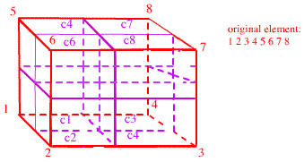

 

REFINE
======

> The **refine** command is used to create more elements when a certain
> criterion is specified.

\
\
refine\_criteria: The choice to refine is based on one of the following.

> **junction** will refine object where field crosses xrefine\
> **constant** will refine object where field &gt; xrefine

\
parameter\_name Parameter sentence.

> **literal\_keyword** Sentence about keyword.\
> **literal\_keyword** Sentence about keyword and variable\_keyword

\
Quad and hexahedral elements may be refined creating quad tree and
octree meshes. Three new attributes are added to the mesh object.

> **itetpar** contains the number of the first child element. The first
> child will contain the first local node of the parent element, the
> other elements are created in the order shown in this diagram.\
> {width="339" height="181"}

\
\
FORMAT:

> **refine**/ refine\_criterion /\[ field\] /\[ interpolation \]
> /refine\_type /ifirst, ilast, istride
> /xrefine/yrefine/zrefine/inclusive-flag/\
> **refine /roughness///edge**
> /ifirst,ilast,istride/distance/surface\_name/ **exclusive|inclusive**\
> **refine/edge\_list///edge/**edge\_list/\
> **refine/interface/// edge/pset,get**,psetname

\
\
EXAMPLES:

> **refine**/**maxsize**///**edge**/**pset,get,** something/.25\
> **refine**/**constant**/ concentration/**log**/**edge**/
> 1,0,0/25.0///**inclusive**\
> **refine/edge\_list///edge/**1 2 23 47**/** will refine the edge with
> endpoints 1 and 2 AND the edge with endpoints 23 and 47.

\
\
LINKS:

> [Grid Refinement](REFINE1.html)\
> [Demo for Grid Refinement](demo_REFINE1.html)
