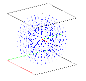

> Description: test createpts
>
> > The objective is to add points to a mesh using the **createpts**
> > command.
> >
> > The test consists of eight examples each exercising the command in a
> > specific geometry (rectangular, cylindrical, spherical) with some
> > variations on input parameters. A geometry is defined in one of the
> > coordinate systems. The **createpts** command is used to create a
> > point distribution within the geometry. The output consists of one
> > gmv file for each example.
>
> Inidvidual Descriptions

 

[Example 3](description3_rtp.html)

**createpts/rtp**

spherical [{width="159"
height="156"}](description3_rtp.html)

[Example 4](description4_brick.html)

**createpts/brick/xyz**

material interface [{width="168"
height="158"}](description4_brick.html)

[Example 2](description2_rtz.html)

**createpts/rtz**

(cylindrical) [{width="116"
height="138"}](description2_rtz.html)

[Example 1](description1_xyz.html)

**createpts/xyz**

(rectangular) [{width="112"
height="87"}](description1_xyz.html)

[Example 5](description5_sphere.html) 

**createpts/sphere/diamond**

partial sphere using region boundaries
[{width="141"
height="166"}](description5_sphere.html)

[Example 6](description6_sphereB.html)

**createpts/sphere**

full sphere using region boundaries [{width="171"
height="161"}](description6_sphereB.html)

[Example 7](description7_brickB.html)

**createpts/brick/xyz**

brick mesh [{width="164"
height="167"}](description7_brickB.html)

[Example 8](description8_sphereC.html)

**createpts/sphere**

gridding a sphere, including materials
[{width="156"
height="153"}](description8_sphereC.html)

[Example 9](description9_random.html) 

**createpts/random/xyz**

random points [{width="114"
height="89"}](description9_random.html)
