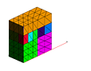
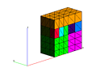
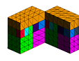

> Example 6: addmesh / match
>
> The objective is to join two meshes to create a third using the
> **addmesh/match** command. Two rectangular meshes are combined. The
> match option concatenates two meshes but allows the second to be
> translated, rotated, and scaled.
>
> Input
>
> > [lagrit\_input\_match](../input_output/lagrit_input_match)
>
> Images of GMV output  
>
>   ---------------------------------------------------------------------------------------------------------------------------------------------------------------- ---------------------------------------------------------------------------------------------------------------------------------------------------------------- ---------------------------------------------------------------------------------------------------------------------------------------------------------------------------
>   [{width="114" height="89"}](image/addmesh_match/addmesh_mesh1.gif) [mesh1](image/addmesh_match/addmesh_mesh1.gif)   [{width="114" height="89"}](image/addmesh_match/addmesh_mesh2.gif) [mesh2](image/addmesh_match/addmesh_mesh2.gif)   [{width="114" height="89"}](image/addmesh_match/addmesh_mesh3.gif) [mesh3](/test/html/image/addmesh_match/addmesh_mesh3.gif)
>   ---------------------------------------------------------------------------------------------------------------------------------------------------------------- ---------------------------------------------------------------------------------------------------------------------------------------------------------------- ---------------------------------------------------------------------------------------------------------------------------------------------------------------------------
>
>
