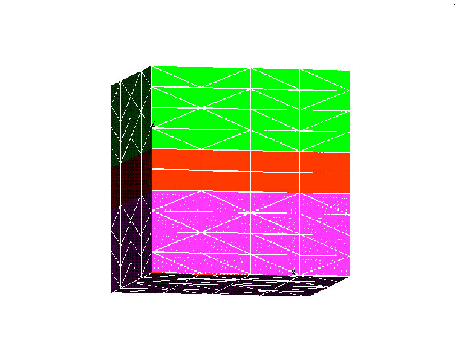
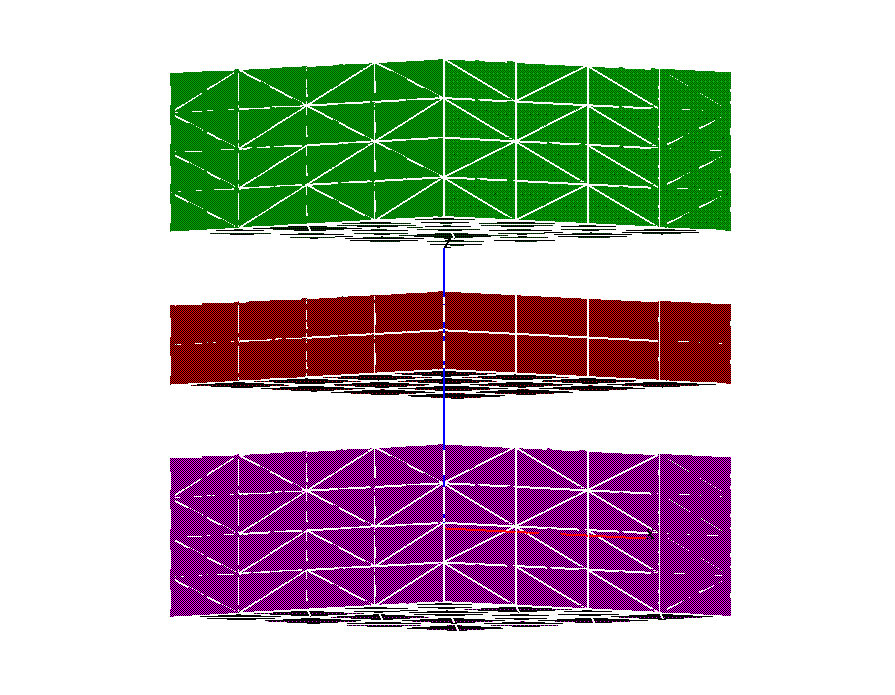
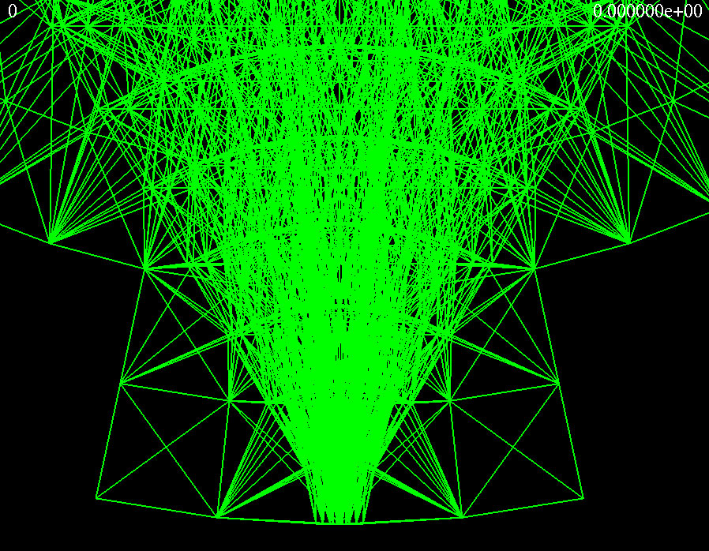
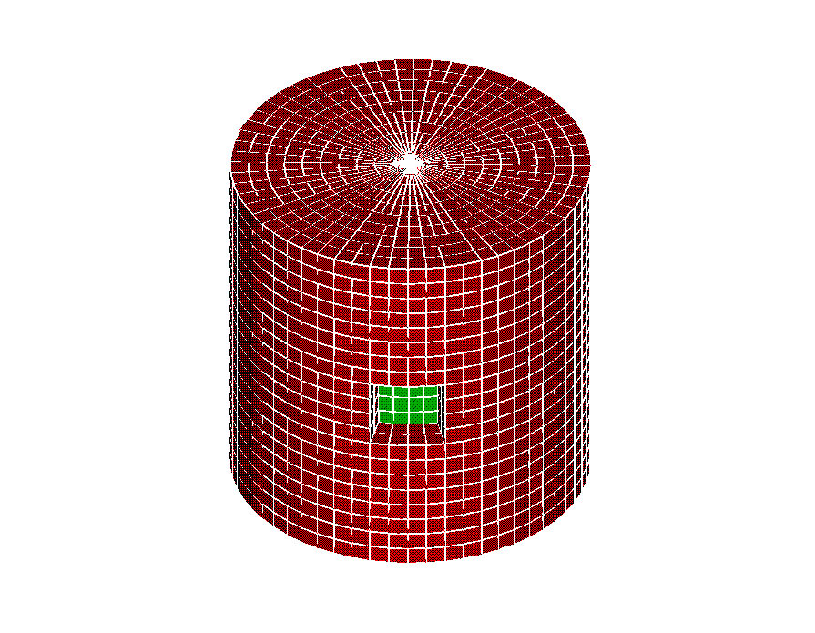

+-----------------------------------+-----------------------------------+
| {.strut             | Hybrid Examples                   |
| width="160" height="1"}           | ---------------                   |
|                                   |                                   |
|                                   | Click on picture to expand        |
|                                   |                                   |
|                                   | +-------------------------------- |
|                                   | ---+----------------------------- |
|                                   | ------+                           |
|                                   | | [{width=" |
|                                   | 22 | [{wid |
|                                   | th="2 |                           |
|                                   | | 5"                              |
|                                   |    | 25"                          |
|                                   |       |                           |
|                                   | | height="225"}](images/hybrid_ex |
|                                   | pa | height="225"}](images/hybrid |
|                                   | 1_exp |                           |
|                                   | | nd.jpg)                         |
|                                   |    | and.jpg)                     |
|                                   |       |                           |
|                                   | |                                 |
|                                   |    |                              |
|                                   |       |                           |
|                                   | | [View input desk](hybrid1.html) |
|                                   |    |                              |
|                                   |       |                           |
|                                   | +-------------------------------- |
|                                   | ---+----------------------------- |
|                                   | ------+                           |
|                                   | | [{width |
|                                   | =" | [{w |
|                                   | idth= |                           |
|                                   | | 225"                            |
|                                   |    | "225"                        |
|                                   |       |                           |
|                                   | | height="225"}](images/snapfile_ |
|                                   | ex | height="225"}](images/hex_ma |
|                                   | jit_e |                           |
|                                   | | pand.jpg)                       |
|                                   |    | xpand.jpg)                   |
|                                   |       |                           |
|                                   | |                                 |
|                                   |    |                              |
|                                   |       |                           |
|                                   | | [View input desk](hybrid2.html) |
|                                   |    |                              |
|                                   |       |                           |
|                                   | +-------------------------------- |
|                                   | ---+----------------------------- |
|                                   | ------+                           |
|                                   |                                   |
|                                   | {.strut             |
|                                   | width="420" height="1"}           |
+-----------------------------------+-----------------------------------+

