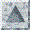
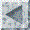

[{width="30"
height="30"}](mstkla.html#MODEL%20FACE:) [{width="30"
height="30"}](GeomRegion.html) [{width="30"
height="30"}](GeomEdge.html)

{width="169" height="131"}

------------------------------------------------------------------------

------------------------------------------------------------------------

   **MODEL FACE OPERATORS:**

------------------------------------------------------------------------

 *void* **GF\_Regions**(*PGeomFace* gf, *PGeomRegn* gr\[2\]);

Get the regions on either side of the face. gr\[0\] is the region on
the\
opposite side of the normal while gr\[1\] is the region on the same
side\
of the normal.  In principle (not in LaGriT), both entries of gr may\
be filled \_AND\_ gr\[0\] may be equal to gr\[1\]. Also in principle,
both\
entries of gr may be NULL.\
 

 

[{width="30"
height="30"}](mstkla.html#MODEL%20REGION:) [{width="30"
height="30"}](GeomRegion.html) [{width="30"
height="30"}](GeomEdge.html)
