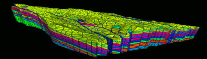

{width="420" height="120"}
{width="180" height="120"}
[]{#content}
Utility Subroutines
-------------------

1.  [Memory Manager](docs/memmang.html)
    (mmgetblk,mmrelblk,mmrelprt,mmincblk, mmfindbk,mmgettyp,mmgetlen,
    mmgetnam,mmprint, mmverify,mmggetbk)
2.  [Mesh Objects](docs/meshob.html) (cmo\_create, cmo\_get\_info,
    cmo\_set\_info, cmo\_get\_name, cmo\_set\_name,
    cmo\_get\_attribute\_name, cmo\_newlen, cmo\_get\_intinfo,
    cmo\_release, cmo\_get\_attinfo, cmo\_get\_length,
    cmo\_set\_attinfo, cmo\_get\_attparam)
3.  [Point Selection](docs/pointsel.html) (getptyp, unpackpc, unpacktp)
4.  [Character Length](docs/charlen.html)   (icharln, icharlnf,
    icharlnb, nulltoblank\_lg)
5.  [Retrieving Point Sets and Element Sets ](docs/retpts.html)
    (eltlimc, pntlimc, pntlimn)
6.  [Array Compression](docs/arrcomp.html) (kmprsm, kmprsn, kmprsnr,
    kmprsnrrr, kmprsp, kmprspr, kmprsz, kmprszr)
7.  [Array Sorting](docs/arrsort.html) (hpsort, hpsort1, hpsorti,
    hpsortim, hpsortimp, hpsortip, hpsortrmp)
8.  [Miscellaneous](docs/miscell.html)
    (setsize,set\_user\_bounds,inside,volume\_element,
    user\_interpolate)
9.  [Geometry Information](docs/geom.html) (geom\_lg.h,
    get\_material\_number)

