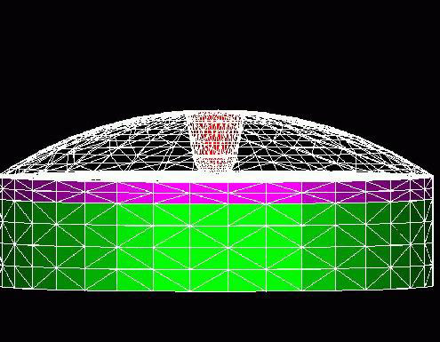

               Pictures Created By Denise George 
              --------------------------------- 

                                      
                                    "385"                     

                                     
                                                 
                                                

