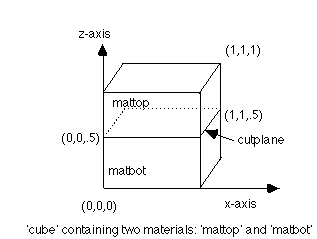

 

> **5. Assign material types to the regions**

Assign materials to regions using
the[**mregion**](commands/MREGION.html) command. This command has
similar syntax to the **[region](commands/REGION.html)** command except
that the interface should not be assigned to any material region. To
assign two materials, *mattop* and *matbot,* to the regions *top* and
*bottom:*\
 

**mregion/**mattop**/ le** cube **and gt** cutplane **/**\
**mregion/**matbot/ **le** cube **and lt** cutplan**e /**

{width="317" height="239"}
