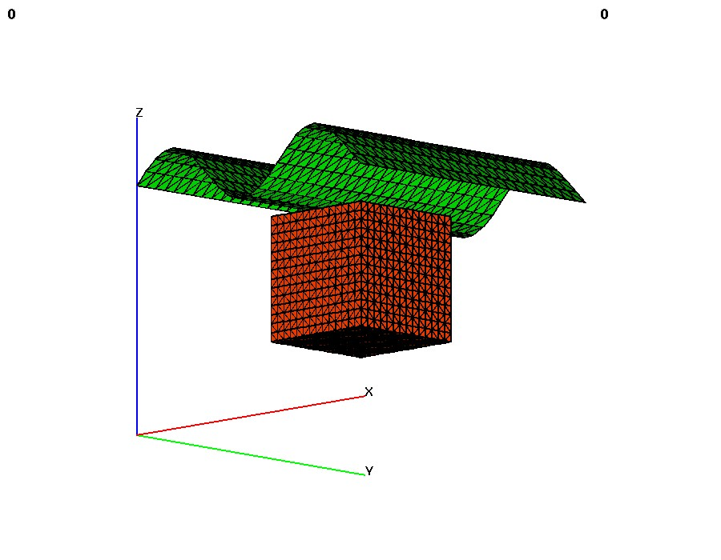
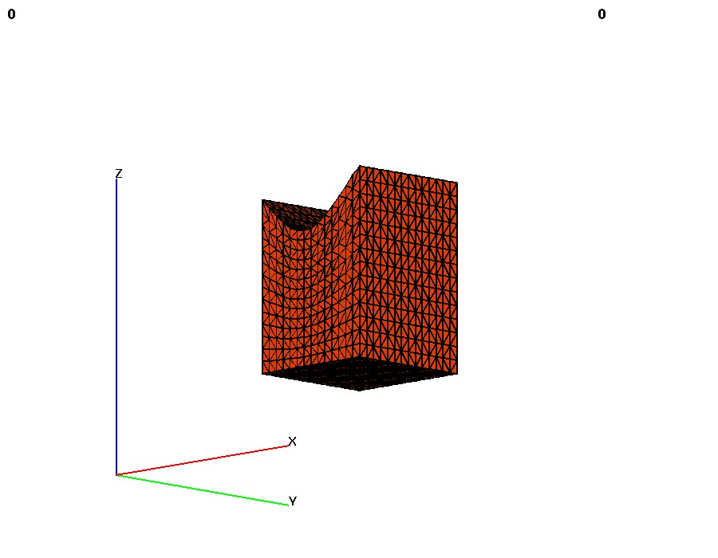

\

> **COMPUTE**
>
> > This command contains modules that compute various attributes and
> > functions based on one or more\
> > mesh objects. This operation will (often) result in new attributes
> > being added to the mesh objects. The\
> > action of the command will be controled by the keyword in the second
> > argument position.
> >
> > distance\_field - keyword for distance field calculation. Determine
> > the minimum distance from any node in\
> > mo\_source to every node in mo\_sink and place the result in the
> > node based floating point attribute,\
> > distance\_field\_attribute in mo\_sink. The computation is
> > accelerated by using the
> > [kdtree](kdtree.html "KDTREE search algorighm") search\
> > algorithm.\
> > \
> > signed\_distance\_field - keyword for signed distance field
> > calculation. Determine the minimum distance    \
> > from any node in mo\_source to every node in mo\_sink and place the
> > result in the node based floating        \
> > point attribute, distance\_field\_attribute in mo\_sink. The
> > computation is accelerated by using the      \
> > [kdtree](kdtree.html "KDTREE search algorighm") search algorithm.
> > Using this option the mo\_source MUST be either a triangle or quad
> > surface        \
> > mesh object. If the surfaces form a topologically closed volume then
> > positive, 'above' distance is in the    \
> > direction of the surface normal vector. Negative is 'below' the
> > surface. If the surface is not a closed        \
> > volume, then the assumptions described in the
> > [surface](SURFACE.html) command are used to determine what is above
> >    \
> > and what is below the surface.\
> >
> > linear\_transform - keyword for an extrapolation from an attribute
> > value in a surface onto every node of\
> > a 3D mesh.
> > []{style="font-family: Courier New,Courier,monospace;"}[Given a 3D
> > mesh and a 2D surface, this command will extrapolate a scalar value
> > from that surface\
> > onto every point of the mesh. This can be used to (for
> > example):]{style="font-family: serif;"}[\
> > ]{style="font-family: serif;"}
> >
> > -   [Propogate head values from a surface onto all nodes of a
> >     mesh.]{style="font-family: serif;"}
> > -   [Expand a mesh to fit a surface, by propogating the
> >     appropriate]{style="font-family: serif;"}[ spatial
> >     coordinate.]{style="font-family: serif;"}
> > -   [Compute the depth relative to a topographic surface to each
> >     node of a mesh.\
> >     ]{style="font-family: serif;"}
> >
> > This is highly dependant on the spatial relation between the mesh
> > and the surface - values from the\
> > surface are extrapolated "downward" into the mesh in the direction
> > specified in the command. The\
> > direction specified in the command must be one of
> > [\[zposznegyposynegxposxneg\]]{style="font-family: Courier New,Courier,monospace;"}.
> > For example,\
> > specifing
> > [zpos]{style="font-family: Courier New,Courier,monospace;"} will
> > result in the upper (positive\
> > z-axis) side of the mesh having attribute values conforming exactly
> > to those on the surface, while the\
> > lower side of the mesh will have whatever attribute values it had
> > previous, with all nodes in between\
> > having attribute values distributed linearly between the two
> > extremes. If a direction is not specified,\
> > it will default to
> > [zpos]{style="font-family: Courier New,Courier,monospace;"}. If an
> > attribute is not specified, it will default to the spatial attribute
> > appropriate\
> > to the chosen direction (i.e. if the direction is
> > [yneg]{style="font-family: Courier New,Courier,monospace;"}, the
> > attribute will default to
> > [yic]{style="font-family: Courier New,Courier,monospace;"}, the
> > y-coordinate of\
> > each node.) The attribute chosen must already exist in both the
> > surface and main meshes.\
> >
> > Other places to look for modules that compute some standard mesh
> > attributes include, [quality](QUALITY.html "Mesh Quality"), which
> > will\
> > compute aspect ratio and volume,
> > [cmo/addatt](cmo/cmo_addatt.html "Add Attribute"), which will
> > compute normal vectors, dihedral angles, solid\
> > angles, meadian points, Voronoi points and more. User functions can
> > be computed with the [math](MATH.html "Math Functions") module.
>
> **FORMAT**:\
>    
> compute/distance\_field/mo\_sink/mo\_source/distance\_field\_attribute
>
> > compute/signed\_distance\_field/mo\_sink/mo\_source/distance\_field\_attribute\
> > \
> > compute/linear\_transform/mo\_main/mo\_surface/\[direction/att\_name\]\
>
> **EXAMPLES**:
>
> > compute / distance\_field / mo\_sink / mo\_src / dfield\
> > \
> > compute / signed\_distance\_field / mo\_sink / mo\_src / dfield\
> >
> > compute / linear\_transform / mo\_sink / mo\_surf        \
> >         (will expand top of mesh to look like the surface)\
> >
> > compute / linear\_transform / mo\_sink / mo\_surf / zpos /
> > water\_head\_value\
> >
> >  
>
> +-----------------------------------------------------------------------+
>  
                                                    
>                                                                        
>  {width="300"     
>  height="300"}                                                         
>                                                                        
>  
                                                                
> +-----------------------------------------------------------------------+
>      cmo / create / cmo_src                                            
>      createpts/rtz/1,91,1/3.,0.,0./3.,270.,0./1,1,1/                   
>      cmo / create / cmo_snk                                            
>      createpts / xyz / 30 30 1 / -5. -5. -5. / 5. 5. 5. / 1 1 1        
>      compute / distance_field / cmo_snk / cmo_src / dfield             
>      finish                                                            
> +-----------------------------------------------------------------------+
>
> :  **Example: distance\_field**
>
> \
>
> 

>
> ****\
>
> 

>
> 
>  {width="300"              y parts                           
>  height="300"}\                         *                             
>                                         cmo / create / mo_tet         
>                                         createpts/random/rtp/.1/1,0,0 
>                                     /1,180,360////.02                 
>                                         connect                       
>                                         resetpts / itp                
>                                         *                             
>                                         * Extract the external surfac 
>                                     e                                 
>                                         *                             
>                                         extract / surfmesh / 1 0 0 /  
>                                     mo_tri / mo_tet / external        
>                                         dump / gmv / tri_surf.gmv / m 
>                                     o_tri                             
>                                         cmo / delete / mo_tet         
>                                         cmo / printatt / mo_tri / -xy 
>                                     z- / minmax                       
>                                         cmo / create / mo_pts         
>                                         *                             
>                                         * Create an xyz node distribu 
>                                     tion and connect the nodes.       
>                                         *                             
>                                         createpts / xyz / 31 31 31 /  
>                                     -1 -1 -1 / 1 1 1 / 1 1 1          
>                                         connect                       
>                                         resetpts / itp                
>                                         *                             
>                                         * Compute the signed distance 
>                                      field                            
>                                         *                             
>                                         compute / signed_distance_fie 
>                                     ld / mo_pts / mo_tri / dfield1    
>                                         addmesh / append / mo_all / m 
>                                     o_pts / mo_tri                    
>                                         dump / gmv / signed_dfield1.g 
>                                     mv / mo_all                       
>                                         *                             
>                                         * Do the same thing but use a 
>                                      surface of quads that make       
>                                         * two nested spheres.         
>                                         *                             
>                                         cmo / create / mo_hex / / / h 
>                                     ex                                
>                                         createpts/sphere/8/5/5000/1.0 
>                                     ,0.5/0.,0.,0./1,0,0.0/            
>                                         filter / 1 0 0                
>                                         resetpts / itp                
>                                         extract / surfmesh / 1 0 0 /  
>                                     mo_quad / mo_hex / external       
>                                         dump / gmv / quad_surf.gmv /  
>                                     mo_quad                           
>                                         *                             
>                                         * Compute the signed distance 
>                                      field                            
>                                         *                             
>                                         compute / signed_distance_fie 
>                                     ld / mo_pts / mo_quad / dfield2   
>                                         addmesh / append / mo_all2 /  
>                                     mo_pts / mo_quad                  
>                                         dump / gmv / signed_dfield2.g 
>                                     mv / mo_all2                      
>                                         cmo / status                  
>                                         quality                       
>                                         cmo / printatt / mo_pts / -al 
>                                     l- / minmax                       
>                                         finish                        
>                                                                       
>                                     \                                 
> 
>
> :  **Example: signed\_distance\_field**
>
> +-----------------------------------------------------------------------+
>  \      
> +-----------------------------------------------------------------------+
>      infile buildsurf.lgi                                              
>                                                                        
>      * Expand the cubical mesh such that its top (positive z-axis) loo 
>  ks like the sinusoidal                                                
>      * surface denoted by zhigh                                        
>      compute / linear_transform / cube / zhigh                         
>                                                                        
>      finish                                                            
> +-----------------------------------------------------------------------+
>           
> +-----------------------------------------------------------------------+
>
> : **\
> Example: linear\_transform**
>
>  

\
