\

cmo/addatt
----------

> The **cmo/addatt** command is used to add and initialize a new mesh
> object attribute. There are two variations on the command syntax. The
> general form is used to add a new attribute to a mesh object. The
> second syntax uses keywords to create and/or fill a valid attribute
> with calculated values. This syntax can also derive a vector attribute
> from three attributes or derive three scalar attributes from a vector
> attribute.
>
> For the general form, the first two parameters, mo\_name/att\_name are
> required. All other parameters will resort to default settings if not
> included on the command line. See the
> **[modatt](http://lagrit.lanl.gov/docs/cmo_modatt.html)** command for
> details on these parameters.
>
> The keyword syntax uses the fourth token on the command line to define
> the type of attribute to create. The syntax for each keyword is
> unique. If the named attribute already exists, values will be
> overwritten with values as indicated by the keyword.
>
> GENERAL FORMAT:
>
> **cmo/addatt** / mo\_name / att\_name / \[ type / rank / length /
> interpolate / persistence / ioflag / \[value\]
>
> \
> KEYWORD FORMAT:
>
> > cmo/addatt/mo\_name/**area\_normal** / normal\_type / att\_v\_name\
> > cmo/addatt/mo\_name/**unit\_area\_normal** / normal\_type /
> > att\_v\_name\
> > cmo/addatt/mo\_name/**volume** / att\_name\
> > cmo/addatt/mo\_name/**voronoi\_volume** / att\_name\
> > cmo/addatt/mo\_name/**hybrid\_volume** / att\_name\
> > cmo/addatt/mo\_name/**voronoi\_varea** / att\_name\_xn att\_name\_yn
> > att\_name\_zn\
> > cmo/addatt/mo\_name/**vector** / att\_v\_snk / att\_xsrc att\_ysrc
> > att\_zsrc\
> > cmo/addatt/mo\_name/**scalar** / att\_xsnk att\_ysnk att\_zsnk /
> > att\_v\_src\
> > cmo/addatt/mo\_name/**ang\_mind** / att\_name\_elem\
> > cmo/addatt/mo\_name/**ang\_maxd** / att\_name\_elem\
> > cmo/addatt/mo\_name/**ang\_minr** / att\_name\_elem\
> > cmo/addatt/mo\_name/**ang\_maxr** / att\_name\_elem\
> > cmo/addatt/mo\_name/**ang\_mind\_solid** / att\_name\_elem\
> > cmo/addatt/mo\_name/**ang\_maxd\_solid** / att\_name\_elem\
> > cmo/addatt/mo\_name/**ang\_minr\_solid** / att\_name\_elem\
> > cmo/addatt/mo\_name/**ang\_maxr\_solid** / att\_name\_elem\
> > cmo/addatt/mo\_name/**edge\_connections** /att\_name\_node\
> > cmo/addatt/mo\_name/**node\_num\_diff** / att\_name\_node\
> > cmo/addatt/mo\_name/**xyz\_rtp** /\[att\_node\_r att\_node\_theta
> > att\_node\_phi\]\
> > cmo/addatt/mo\_name/**xyz\_rtz** /\[att\_node\_r att\_node\_theta
> > att\_node\_z\]\
> > cmo/addatt/mo\_name/**voronoi** / x\_coord\_elem y\_coord\_elem
> > z\_coord\_elem\
> > cmo/addatt/mo\_name/**median** / x\_coord\_elem y\_coord\_elem
> > z\_coord\_elem\
> > cmo/addatt/mo\_name/**synth\_normal\_area**\
> > cmo/addatt/mo\_name/**synth\_normal\_angle**\
> > cmo/addatt/mo\_name/**sumnode** / att\_name\_elem / att\_name\_node\
> > cmo/addatt/mo\_name/**avgnode** / att\_name\_elem / att\_name\_node\
> > cmo/addatt/mo\_name/**minnode** / att\_name\_elem / att\_name\_node\
> > cmo/addatt/mo\_name/**maxnode** / att\_name\_elem / att\_name\_node\
> > cmo/addatt/mo\_name/**quad\_quality** / att\_name\_quality /
> > att\_name\_regularity / att\_name\_flag\
>
> > **area\_normal**: creates element vector attribute att\_v\_name and
> > fills with the x,y,z components of the area normal for each face.
> > The new attribute is
> > [nelements](http://lagrit.lanl.gov/docs/meshobject.html#nelements)
> > in length, type is
> > [vdouble](http://lagrit.lanl.gov/docs/meshobject.html#type), and
> > rank is
> > [vector](http://lagrit.lanl.gov/docs/meshobject.html#vector).
> > normal\_type choices include **xyz, rtz**, and **rtp**. The
> > area\_normal is a vector perpendicular to the triangle face with
> > length equal to the area of the triangle. Currently implemented for
> > **xyz** on triangles only.
> >
> > **unit\_area\_normal**: creates vector attribute att\_v\_name and
> > fills with the x,y,z direction components of the area normal for
> > each face. The new attribute is nelements in length, type is
> > VDOUBLE, and rank is vector. normal\_type choices include **xyz,
> > rtz**, and **rtp**. The unit\_area\_normal is a vector perpendicular
> > to the triangle face with length equal to one. Currently implemented
> > for **xyz** on triangles only.
> >
> > **volume** or **area**: creates an element attribute nelements in
> > length and type VDOUBLE. For **volume** keyword the att\_name
> > attribute is filled with **volume**(if 3D), **area**(if 2D) or
> > **length**(if lines). Currently implemented for triangle areas.
> >
> > **voronoi\_volume** : creates a node attribute nnodes in length and
> > type VDOUBLE. Currently implemented for a tetrahedral mesh by
> > calling the build stor function to form the Voronoi bounding area
> > for each node. (See more in [dump/stor](../dump/DUMP3.html).)
> >
> > **hybrid\_volume**: creates a node attribute `nnodes` in length and
> > of type `VDOUBLE` which contains the volume of each hybrid
> > median-Voronoi control volume. This is currently implemented for a
> > tetrahedral mesh by calling the build stor function with the
> > `hybrid` option. See [dump/stor](../dump/DUMP3.html) for details on
> > what hybrid median-Voronoi volumes are. Currently this option is
> > only available for 3D tetrahedral meshes.
> >
> > **voronoi\_varea** : creates three node attributes nnodes in length
> > and type VDOUBLE. The attributes represent each of the x,y,z
> > components for the Voronoi areas formed by surrounding nodes.
> > Currently implemented for a triangle mesh by calling the same
> > routine that is used to compute the Voronoi areas for the external
> > faces of a tetrahedral mesh. Works only on a triangle mesh. (See
> > more in dump/zone\_outside)
> >
> > **vector**: creates attribute of rank vector from three existing
> > scalar attributes.
> >
> > **scalar**: creates three scalar attributes from an existing vector
> > attribute.
> >
> > **voronoi** : creates three element attributes (default names xvor,
> > yvor, zvor) that are the coordinates of the Voronoi point (center of
> > circumscribed circle or sphere) of each element. This is only valid
> > for elements of type tri and tet. This command does not check if a
> > mesh is Delaunay, so a better syntax might be to call this
> > circumscribed\_center.
> >
> > **median**: creates three element attributes (default names xmed,
> > ymed, zmed) that are the coordinates of the median point (average
> > value of the vertices) of each element. This is valid for all
> > element types.
> >
> > The following commands create element attributes related to dihedral
> > angle and solid angle:**\
> > ang\_mind** : create a scalar element attribute and fill it with the
> > minimum dihedral angle (degrees) of the element\
> > **ang\_minr** : create a scalar element attribute and fill it with
> > the minimum dihedral angle (radian) of the element\
> > **ang\_maxd** : create a scalar element attribute and fill it with
> > the maximum dihedral angle (degrees) of the element\
> > **ang\_maxr** : create a scalar element attribute and fill it with
> > the maximum dihedral angle (radian) of the element\
> > Dihedral angle will be between 0 and 2π.
> >
> > **ang\_mind\_solid** : create a scalar element attribute and fill it
> > with the minimum solid angle (degrees) of the element\
> > **ang\_maxd\_solid** : create a scalar element attribute and fill it
> > with the minimum solid angle (radian) of the element\
> > **ang\_minr\_solid** : create a scalar element attribute and fill it
> > with the maximum solid angle (degrees) of the element\
> > **ang\_maxr\_solid** : create a scalar element attribute and fill it
> > with the maximum solid angle (radian) of the element\
> > Solid angle will be between 0 and 4π.
> >
> > Note: Dihedral angle calculations is supported for tri, quad, tet,
> > pyrimide, prism, hex.\
> > Note: Solid angle calculation is only supported for tet elements.\
> > See also the command **[quality](../QUALITY.html)** for adding
> > attributes such as element aspect ratio(quality/aratio) and edge
> > length ratio (quality/edge\_ratio), minimum edge length (quality/
> > edge\_min) and maximum edge length (quality/edge\_max).
> >
> > **edge\_connections**: creates and integer attribute with the number
> > of edge connections to each node.\
> > **node\_num\_diff**: creates an integer attribute with the maximum
> > difference in node number between the node and any node it is
> > connected to. That is for node i connected to nodes j\_1, j\_2,
> > ...j\_n, the attribute will contain attribute=max(i-j\_1,i-j\_2,
> > ... i-j\_n)
> >
> > **xyz\_rtp**: create three node attributes and fill them with the
> > node coordinate, x,y,z in spherical coordinates, r,theta,phi.
> > Default values for the attribute, if not specified are, [c\_r,
> > c\_theta, c\_phi]{.style1}.\
> > **xyz\_rtz**: create three node attributes and fill them with the
> > node coordinate, x,y,z in cylindrical coordinates, r,theta,z.
> > Default values for the attribute, if not specified are, [c\_r,
> > c\_theta, c\_z ]{.style1}.
> >
> > **synth\_normal\_area** : create node attributes, [x\_n\_norm,
> > y\_n\_norm, z\_n\_norm]{.style1}, and fill them with the area
> > weighted normal of each node.\
> > **synth\_normal\_angle** : create a node attributes, [x\_n\_norm,
> > y\_n\_norm, z\_n\_norm]{.style1}, and fill them with the angle
> > weighted normal of each node.\
> > The synthetic node normal calculations are only supported for mesh
> > objects of type line, tri and quad. If one wants to compute the
> > normals to, for example, the outside nodes of a hex or tet mesh, one
> > must first [extract](../EXTRACT1.html) a surface mesh and then
> > compute the normals to the surface mesh. The synthetic normal is
> > computed by computing the normal to all elements incident upon a
> > node and then taking the weighted average of all the normals. The
> > weight factor is based on area or incident angle depending upon
> > which option is selected.
> >
> > **sumnode** : create an element attribute [att\_name\_elem]{.style1}
> > and fill it with the sum of the elements' node attribute,
> > [att\_name\_node]{.style1}.\
> > **avgnode** : create an element attribute [att\_name\_elem]{.style1}
> > and fill it with the average of the elements' node attribute,
> > [att\_name\_node]{.style1}.\
> > **minnode** : create an element attribute [att\_name\_elem]{.style1}
> > and fill it with the minimum value of the elements' node attribute,
> > [att\_name\_node]{.style1}.\
> > **maxnode** : create an element attribute [att\_name\_elem]{.style1}
> > and fill it with the maximum of the elements' node attribute,
> > [att\_name\_node]{.style1}.\
> >
> > **quad\_quality** : create element attributes `att_name_quality`,
> > `att_name_regularity`, and `att_name_flag`. These three attributes
> > all describe the quality of each quadrilateral in a quad mesh.
> >
> > The first attribute represents the measure
> >
> > 

> >
> > 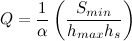
> >
> > 

> >
> > where [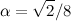]{.equation} is a normalization constant
> > and [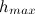]{.equation} is the longest length among
> > the four edges and the two diagonals. [ 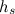
> > ]{.equation} is defined as
> >
> > 

> >
> > 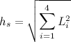,
> >
> > 

> >
> > where [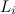]{.equation} is the length of edge *i*.
> > [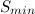]{.equation} is the minimum area of the four
> > triangles that can be constructed by adding one or the other
> > diagonal to the quad. This metric ranges from zero for poor quality
> > quads to one for high quality quads. 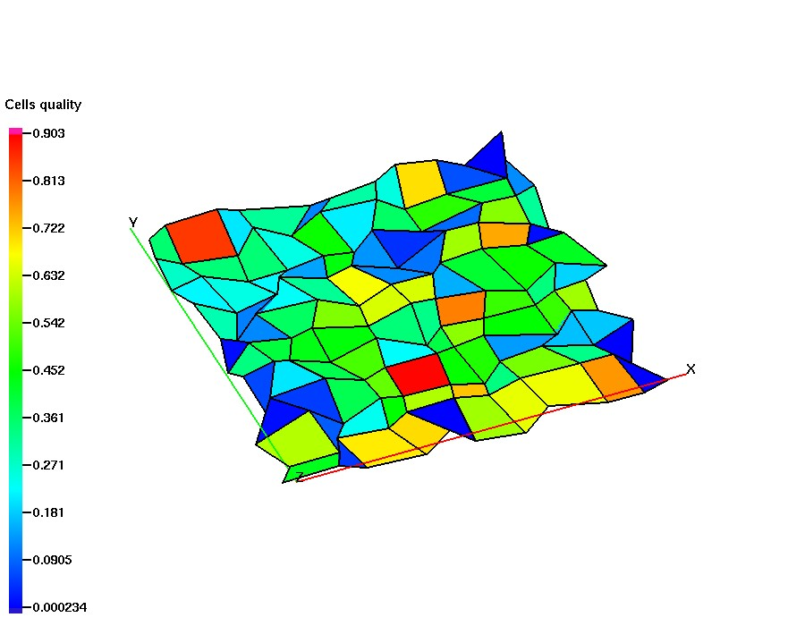
> >
> > The second attribute represents the *regularity* of each quad ABCD,
> > defined as
> >
> > 

> >
> > 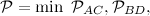
> >
> > 

> >
> > where
> >
> > 

> >
> > 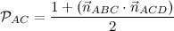
> >
> > 

> >
> > and
> >
> > 

> >
> > 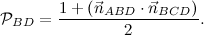
> >
> > 

> >
> > This is a measure of the extent to which the quad is planar, which
> > cannot be detected by the previous metric alone. A perfectly planar
> > quad will have a score of one, while a severely warped quad will
> > have a score of zero.
> >
> > Finally, the third attribute is an integer flag which gives some
> > qualitative information about each quad:
> >
> >  0 (Good) 
> > :   The quad is non-degenerate and for either of the two ways we can
> >     draw a diagonal across it, the area vectors of the two triangles
> >     have a positive dot product.
> >
> >  1 (Degenerate) 
> > :   At least one of the triangles determined by three of the
> >     vertices of the quad has zero area. In other words, the quad has
> >     degenerated into a triangle (or worse).
> >
> >  2 (Warped) 
> > :   One of the quad's diagonals divides it into two triangles whose
> >     area vectors have a negative dot product. If the quad is planar
> >     then this means it is self-intersecting (or someone entered the
> >     vertices in the wrong order by mistake).
>
> \
> EXAMPLES:
>
> > [**cmo**/**addatt**/cmo/boron1/vdouble/scalar/nnodes]{.style1}
> > Create node attribute named boron1 with default interpolate (linear)
> > and default persistence (temporary).
> > [**cmo**/**addatt**/cmo/elem\_br/vdouble/scalar/nelements]{.style1}
> > Create element attribute named elem\_br with default interpolate
> > (linear) and default persistence (temporary).
> > [**cmo/addatt/**-cmo-/boron2/vdouble/scalar/nnodes/asinh/permanent/gl/2.0
> > ]{.style1}
> > Create in the currently active mesh object a node attribute named
> > boron2 and initialize it with value 2.0, set IO flages to gmv and
> > LaGriT dumps, set interpolation method to asinh..
> > [**cmo/addatt/**cmo1/boron3/vdouble/scalar/nnodes/user/temporary
> > ]{.style1}
> > Create temporary node attribute named boron3.
> > [**cmo/addatt/-default-/**boron3 ]{.style1}
> > Create attribute named boron3 with default mesh object settings.
> > [**cmo/addatt**/ cmotri / **area\_normal** / **xyz** / anorm
> > ]{.style1}
> > Create and fill element vector named anorm with the x,y,z components
> > for area normals of each triangle.
> > [**cmo/addatt**/ cmotri / **unit\_area\_normal** / **xyz** / n\_face
> > ]{.style1}
> > Create and fill element vector named n\_face with the x,y,z
> > components for unit area normals of each triangle.
> > [**cmo/addatt**/cmo1/ **scalar** / xnorm, ynorm, znorm / anorm
> > ]{.style1}
> > Create attributes xnorm, ynorm, znorm from the three components of
> > the vector attribute anorm.
> > [**cmo/addatt**/cmo1/ **vector** / vnorm /xnorm, ynorm, znorm
> > ]{.style1}
> > Create vector attribute vnorm from the three attributes xnorm,
> > ynorm, znorm.
> > [**cmo/addatt**/ cmotri / **area** / darea ]{.style1}
> > Create and fill attribute named darea with area of each triangle.\
> > [**cmo/addatt**/ cmotet / **voronoi\_volume** / vor\_vol ]{.style1}
> > Create and fill attribute named vor\_vol with Voronoi volume of each
> > node in tetrahedral mesh.\
> > [**cmo/addatt**/ cmotet / **hybrid\_volume** / hybrid\_vol
> > ]{.style1}
> > Create and fill an attribute named `hybrid_vol` with the hybrid
> > median-Voronoi volume of each node in a tetrahedral mesh.\
> > [**cmo/addatt**/ cmotri / **voronoi\_varea** / xvarea yvarea zvarea
> > ]{.style1}
> > Create and fill attributes xvarea, yvarea, and zvarea with xyz
> > components of the Voronoi areas for each node in triangle mesh.\
> > [**cmo/addatt**/ cmoquad / **quad\_quality** / quality regularity
> > flag ]{.style1}
> > Create attributes named `quality`, `regularity`, and `flag` with
> > several quad quality measures (see above).
> > [cmo / **addatt** / cmo / **ang\_mind** / ang\_mind\
> > cmo / **addatt** / cmo / **ang\_minr** / ang\_minr\
> > cmo / **addatt** / cmo / **ang\_maxd** / ang\_maxd\
> > cmo / **addatt** / cmo / **ang\_maxr** / ang\_maxr\
> > cmo / **addatt** / cmo / **ang\_mind\_solid** / sang\_mind\
> > cmo / **addatt** / cmo / **ang\_minr\_solid** / sang\_minr\
> > cmo / **addatt** / cmo / **ang\_maxd\_solid** / sang\_maxd\
> > cmo / **addatt** / cmo / **ang\_maxr\_solid** / sang\_maxr\
> > \
> > cmo / **addatt** / cmo / **synth\_normal\_area**\
> > cmo / **addatt** / cmo / **synth\_normal\_angle**\
> > \
> > cmo / **addatt** / cmo / **sumnode** / elem\_sum\_imt / imt\
> > cmo / **addatt** / cmo / **maxnode** / elem\_max\_boron /
> > boron]{.style1}\
> > \
> > \

\
