**LaGriT Examples and Demos**

> [2d\_connect](2d_connect/test/html/main_2d_connect.html)[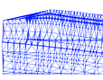"114"
> height="89"](2d_connect/test/html/main_2d_connect.html)

[triangulate"114"
height="89"](triangulate/test/html/main_tri.html)

[connect](connect/test/html/main_connect.html)[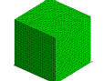"114"
height="89"](connect/test/html/main_connect.html)

[2d\_recon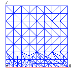"110"
height="110"](2d_recon/test/html/main_2d_recon.html)

[rotatept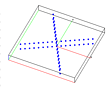"112"
height="87"](rotatept/test/html/main_rotatept.html)

[dump](dump/test/html/main_dump.html)["114"
height="89"](dump/test/html/main_dump.html)

[quality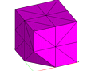"114"
height="89"](quality_pcc/test/html/main_qual.html)

------------------------------------------------------------------------

addmesh options addmesh (index) addmesh/add addmesh/amr addmesh/append
addmesh/delete addmesh/match addmesh/merge

[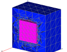"120"
height="95"](addmesh/test/html/main_addmesh.html)

------------------------------------------------------------------------

createpts options createpts/xyz createpts/rtz createpts/rtp
creatpts/brick (a) createpts/brick (b) createpts/sphere (a)
createpts/sphere (b) createpts/sphere (c) createpts/random

[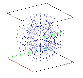"121"
height="111"](createpts/test/html/main_createpts.html)

[hextotet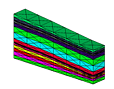"114"
height="89"](hextotet/test/html/main_hextet.html)

[trans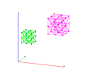"114"
height="89"](trans/test/html/main_trans.html)

[rmmat"114"
height="89"](rmmat/test/html/main_rmmat.html)

[regnpts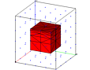"114"
height="89"](regnpts/test/html/main_regnpts.html)

[sort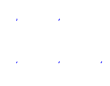"110"
height="86"](sort/test/html/main_sort.html)

[pset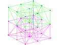"114"
height="89"](pset/test/html/main_pset.html)

[negative\_aij/rivara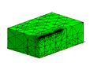"114"
height="89"](refine_rivara/test/html/main_rivara.html)

\
Other Examples: <http://meshing.lanl.gov/proj/#EXAMPLES_open>
