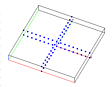

> Description: test rotatept
>
> > > The objective is to test the **rotatept** command.\
> > >  \
> > > [Example 1](description_rotatept.html)
> > > ["112"
> > > height="87"](description_rotatept.html)

\
\
\
\
\

[Next Demo](../../../demos/triangulate/html/main_tri1.html)
