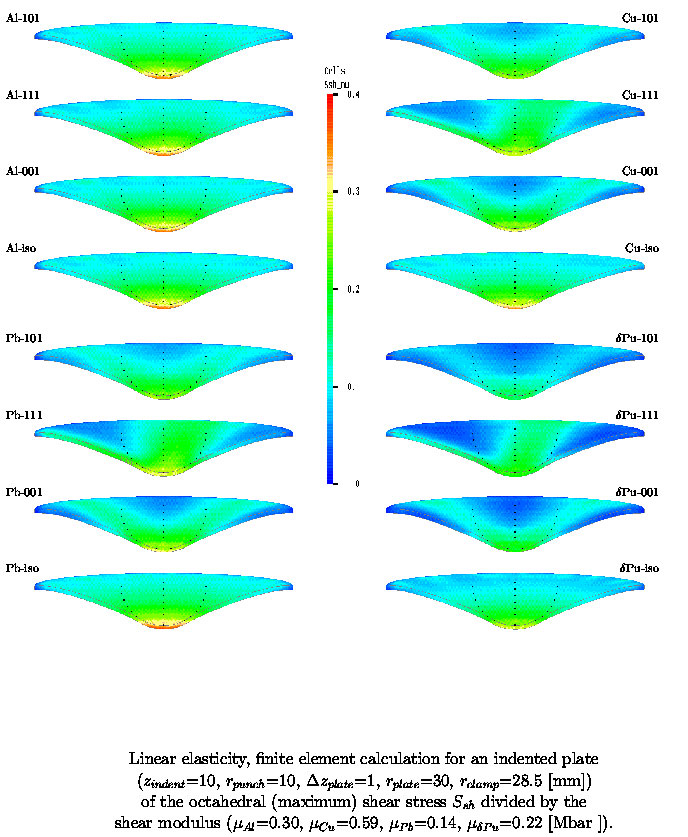
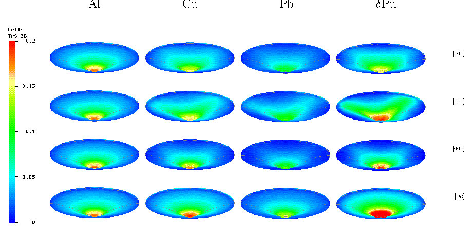

 ansparent.gif){.strut              Pictures Created by Tinka Gammel  
 width="160" height="1"}            --------------------------------  

                                    {width="495"  
                                    height="600"}                     

                                    {width="495" 
                                    height="600"}                     

                                    {.strut             
                                    width="420" height="1"}           

