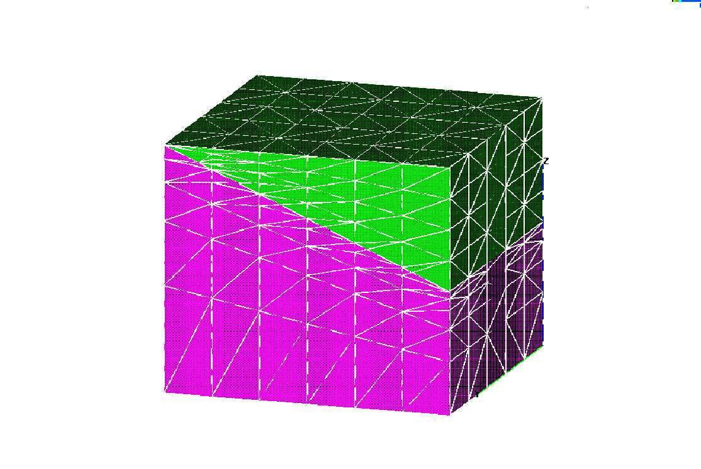
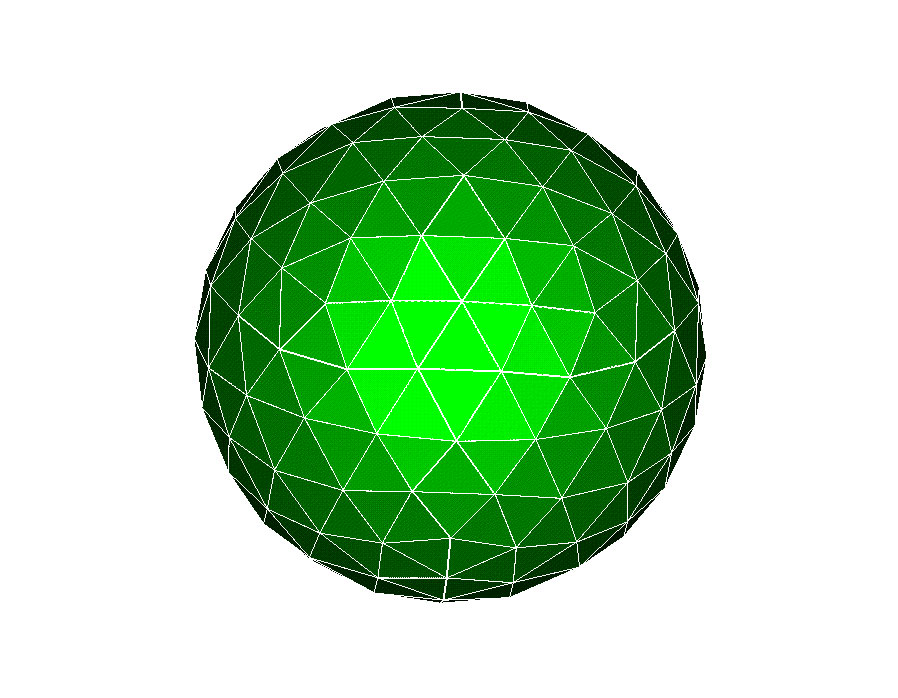
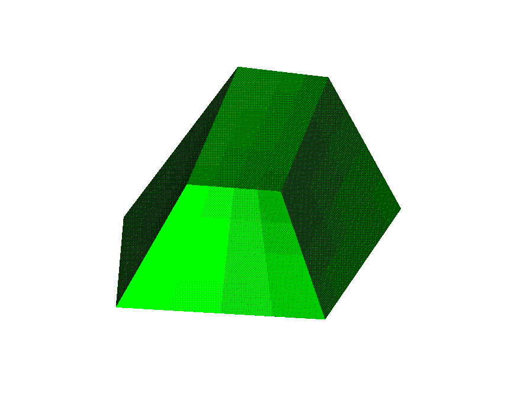
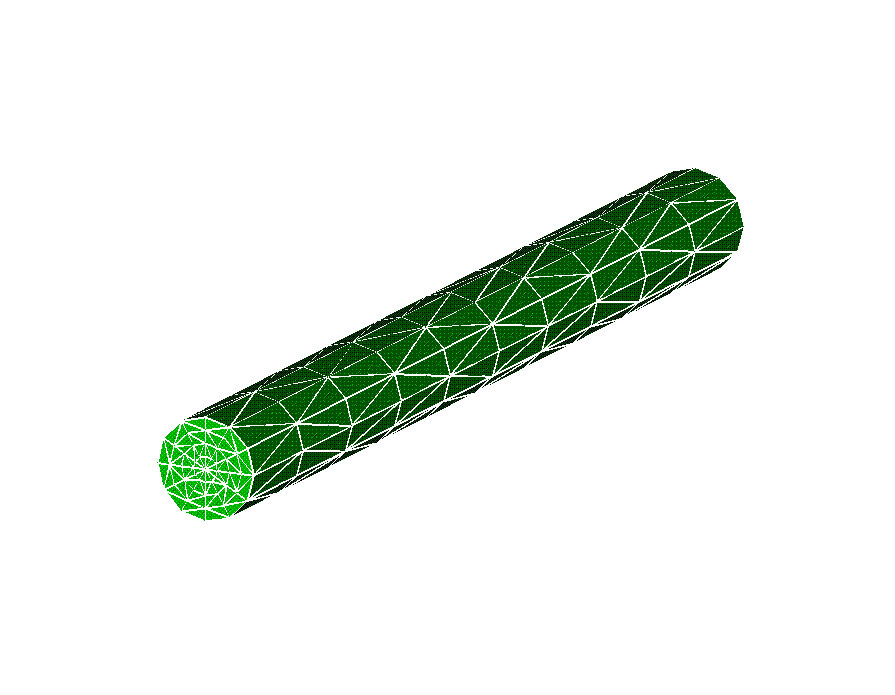
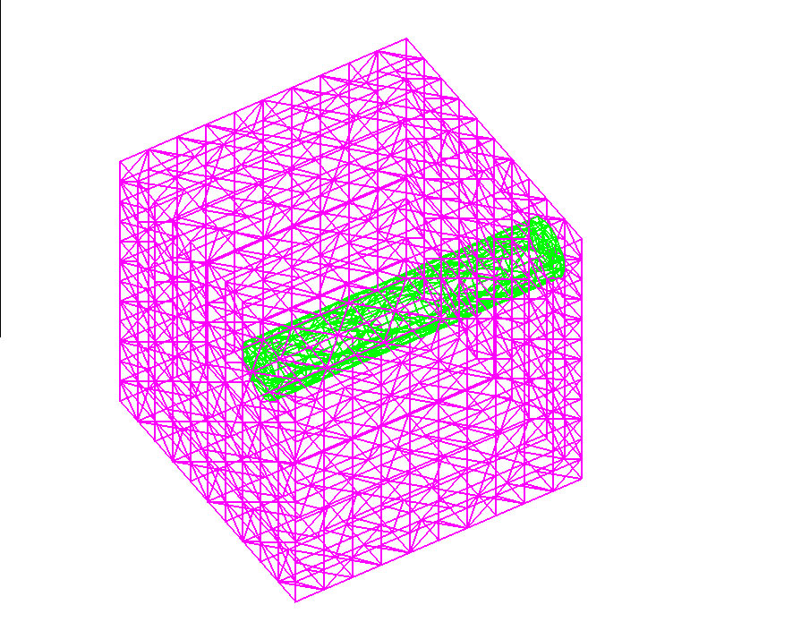

               Geometry Examples                 
              -----------------                 

                                    Click on picture to expand        

                                    +-------------------------------- 
                                    ---+----------------------------- 
                                    ------+                           
                                     [ 
                                    "2                               

                                     25"                             

                                     "225"](images/boxtilt_e 
                                    xp                               

                                     and.jpg)                        

                                     [View input desk](semi.md)    

                                    +-------------------------------- 
                                    ---+----------------------------- 
                                    ------+                           
                                     [{widt 
                                    h=  [" 
                                    225"                             
                                     "225"                           
                                        "225"](images/hex_ex 
                                    pand.                            
                                     "225"](images/sn.sphere 
                                    _e  jpg)                         

                                     xpand.jpg)                      

                                        [View input desk](geohex.htm 
                                    l)                               
                                     [View input desk](geosphere.htm 
                                    l)                               

                                    +-------------------------------- 
                                    ---+----------------------------- 
                                    ------+                           
                                     [{width 
                                    ="  [{width 
                                    ="225                            
                                     225"                            
                                        "                            

                                     "225"](images/cylinder_ 
                                    ex  "225"](images/coord_ 
                                    expan                            
                                     pand.jpg)                       
                                        d.jpg)                       

                                     [View input desk](geocyl.md)  
                                        [View imput desk](geocoord.h 
                                    tml)                             
                                    +-------------------------------- 
                                    ---+----------------------------- 
                                    ------+                           

                                     
                                                 
                                                

