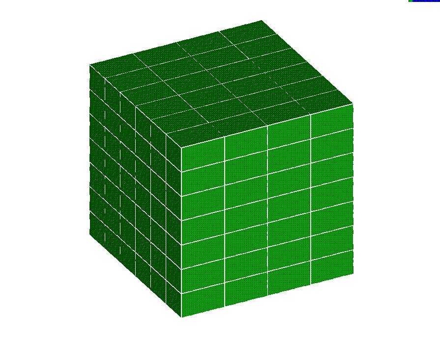
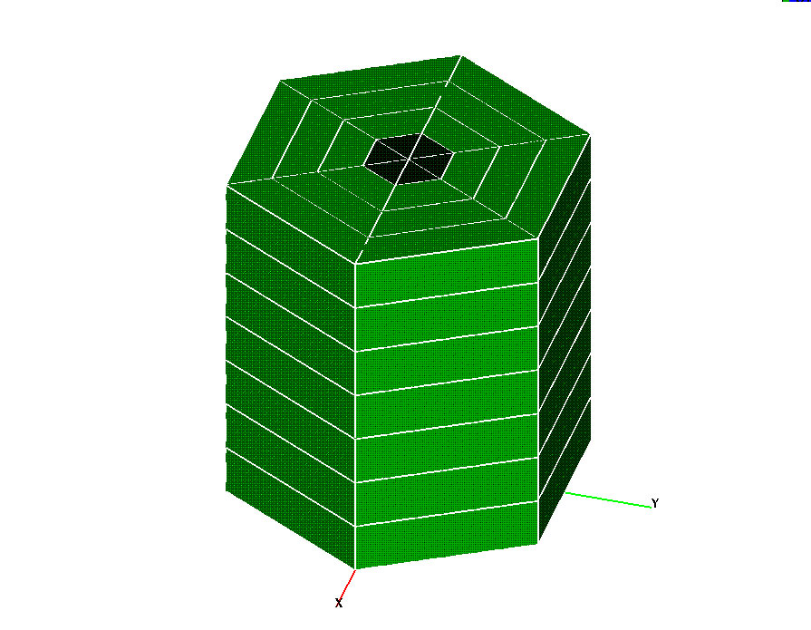
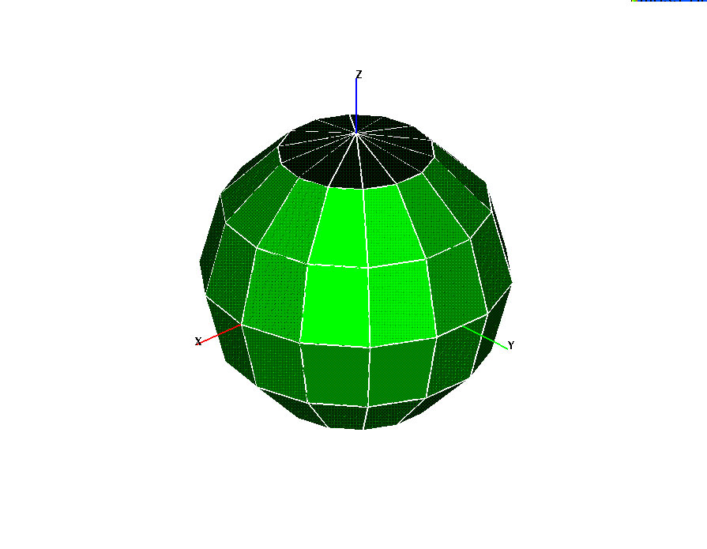

               Hex Examples                      
              ============                      

                                    Click on picture to expand        

                                    +-------------------------------- 
                                    ---+----------------------------- 
                                    ------+                           
                                     Cartesian coordinates           
                                                                     

                                     ---------------------           

                                     [ 
                                    "2                               

                                     25"                             

                                     "225"](images/hex_xyz.j 
                                    pg                               

                                     )                               

                                     [View input desk](hex1.md)    

                                    +-------------------------------- 
                                    ---+----------------------------- 
                                    ------+                           
                                     Cylindrical coordinates         
                                        Spherical coordinates        

                                     -----------------------         
                                        ---------------------        

                                     [ 
                                    "2  [{wid 
                                    th="2                            
                                     25"                             
                                        25"                          

                                     "225"](images/hex_rtz.j 
                                    pg  "225"](images/hex_rt 
                                    p.jpg                            
                                     )                               
                                        )                            

                                     [View input desk](hex2.md)    
                                        [View input                  

                                        desk](images/hex_rtp.jpg)    

                                    +-------------------------------- 
                                    ---+----------------------------- 
                                    ------+                           

                                     
                                                 
                                                

