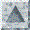

["30"
height="30"](http://www.ees.lanl.gov/staff/rao/mstkla/mstkla.html#MSTKLA_Init) ["30"
height="30"](http://www.ees.lanl.gov/staff/rao/mstkla/prelim.html) ["30"
height="30"](http://www.ees.lanl.gov/staff/rao/mstkla/MeshRegion.html)

------------------------------------------------------------------------

------------------------------------------------------------------------

**MESH INITIALIZATION:**  

------------------------------------------------------------------------

 \
*void* **MSTKLA\_Init**(*void*);

Initialize the mesh toolkit.

------------------------------------------------------------------------

------------------------------------------------------------------------

**MESH OPERATORS**

 

These operators work on variables of type *PMeshObj.*

------------------------------------------------------------------------

\
*PMeshObj* **MESH\_Create**();

Creates a default mesh object and returns it - At this point all the
info\
in it is useless.

------------------------------------------------------------------------

*void* **MESH\_InitFromFile**(*PMeshObj* mesh, *char \**filename, *char
\**format, *int* iotype, *char \*\**name);

Read a mesh in from "*filename*" and initialize the "*mesh*".\
The file is in the format "*format*" ("*lagrit*" for LaGriT dumps,
"*gmv*" for GMV files, "*avs*" for AVS files).\
*'iotype'* is 1 for ascii and 0 for binary.\
'*name*' is the name of the mesh that is read and returned\
If a LaGriT file is read, the geometric model info will be read as well.

------------------------------------------------------------------------

\
*void* **MESH\_InitFromCMO**(*PMeshObj* mesh, *char* \*cmoname);

Initialize the mesh object from a given cmo. If '*cmoname*' is NULL (say
sent in as the character string ""), the mesh object is initialized from
the default mesh object. If not the given cmo is made is active and the
mesh object is\
initialized from that.

"31" height="32"This implies that
sometime in the middle of a LaGriT subroutine, one can call a C routine
which initializes a mesh object and then uses the functionality of
MSTKLA!! (Cool!)

------------------------------------------------------------------------

\
*int* **MESH\_Select**(*PMeshObj* mesh);

Make a particular mesh object active

------------------------------------------------------------------------

*void* **MESH\_Delete**(*PMeshObj* mesh);

Delete a particular mesh object.

"31" height="32"\*\* NOT YET IMPLEMENTED
\*\* WILL BE IN SOON

------------------------------------------------------------------------

*void* **MESH\_WriteToFile**(*PMeshObj* mesh, *char* \*filename, *char*
\*format, *int* iotype);

"31" height="32"\*\* NOT YET IMPLEMENTED
\*\* WILL BE IN SOON \*\*

------------------------------------------------------------------------

*PMeshObj* **MESH\_Duplicate**(*PMeshObj* mesh);

"31" height="32"\*\* NOT YET IMPLEMENTED
\*\*

------------------------------------------------------------------------

*int* **MESH\_NumVertices**(*PMeshObj* mesh);

Number of vertices (nodes) in the mesh.

"27" height="31"\*\*\* IMPORTANT
\*\*\*\
This count may include deleted vertices, parent vertices and other\
types of vertices that should be ignored. So when looping through\
vertices of a mesh, one should check if the vertex is to be ignored\
by checking if MV\_Type returns VIGNORE or VDELETED.

------------------------------------------------------------------------

*int* **MESH\_NumRegions**(*PMeshObj* mesh);

Number of regions (elements) in the mesh.

"27" height="31"\*\*\* IMPORTANT
\*\*\*\
This count may include deleted regions. While looping through the\
regions of a mesh, one should check if the region is to be ignored\
by checking if MR\_Type returns RDELETED.

------------------------------------------------------------------------

\
*PMeshVert* **MESH\_Vertex**(*PMeshObj* mesh, *int* i);

Fetch the i'th vertex (node) of the mesh (This is C so remember i\
starts from 0) The returned mesh vertex object can be queried for\
information. The returned vertex must always be checked for its type\
to see if it deleted or must otherwise be ignored.

------------------------------------------------------------------------

*PMeshRegn* **MESH\_Region**(*PMeshObj* mesh, *int* i);

Fetch the i'th region (element) of the mesh. The returned mesh region\
can be queried for information. The returned region must be checked if\
it is a deleted region.

------------------------------------------------------------------------

\
*void* **MESH\_BldUpAdj**(*PMeshObj* mesh);

Build the vertex to region connectivity. This will allow upward\
adjacency operator MV\_Regions to be called. In fact those operators\
will function properly only after this is called.

------------------------------------------------------------------------

\
*void* **MESH\_DelUpAdj**(*PMeshObj* mesh);

Delete the vertex to region connectivity information to save\
memory. It is not possible for MSTKLA to determine when this\
information is not needed and call this routine automatically.

------------------------------------------------------------------------

\
*void* **MESH\_IncrNodeLists**(*PMeshObj* mesh);

Increment all the node lists.

"31" height="32"(\*\* NOT FULLY TESTED
\*\*)

------------------------------------------------------------------------

\
*void* **MESH\_IncrElemLists**(*PMeshObj* mesh);

Increment all the element lists.

"31" height="32"(\*\* NOT FULLY TESTED
\*\*)

------------------------------------------------------------------------

\
*void* **MESH\_CmprNodeLists**(*PMeshObj* mesh);

Compress all the element lists.

"31" height="32"\*\*\* NOT YET
IMPLEMENTED \*\*\*

"27" height="31"\*\*\* IMPORTANT !!!
\*\*\*

There is one side effect of compression of lists. If one is storing a\
list of node numbers or PMeshVerts (which for the LaGriT interface are\
just integers cast as pointers), then after compression, the node\
numbers or PMeshVert "addresses" may not be referring to the nodes you\
think they are.

------------------------------------------------------------------------

\
*void* **MESH\_CmprElemLists**(*PMeshObj* mesh);

Compress all the element lists.  \*\*\* NOT YET IMPLEMENTED \*\*\*

"27" height="31"\*\*\* IMPORTANT !!!
\*\*\*

There is one side effect of compression of lists. If one is storing a\
list of element numbers or PMeshRegns (which for the LaGriT interface\
are just integers cast as pointers), then after compression, the\
element numbers or PMeshRegn "addresses" may not be referring to the\
elements you think they are.\
 \
 

["30"
height="30"](http://www.ees.lanl.gov/staff/rao/mstkla/mstkla.html#MSTKLA_Init) ["30"
height="30"](http://www.ees.lanl.gov/staff/rao/mstkla/prelim.html) ["30"
height="30"](http://www.ees.lanl.gov/staff/rao/mstkla/MeshRegion.html)
