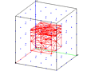

> Description: test regnpts
>
> > > The objective is to test the **regnpts** command.\
> > >  \
> > > [Example 1](description_regnpts.html)
> > > ["114"
> > > height="89"](description_regnpts.html)
