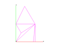
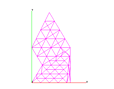
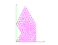
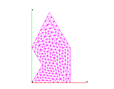

Example 1: test using triangulate to create a 2d mesh.\

> The objective is to use the **triangulate** command to create a mesh
> on a polygonal point distribution.
>
> The output consists of five gmv files showing various stages of the
> mesh building process.

> [lagrit\_input\_tri](../input_output/lagrit_input_tri)
>
Images of GMV input and output

[Concave point distribution with crude
triangulation](image/triang1.gif)["110"
height="86"](image/triang1.gif)

[Refinement](image/triang2.gif)["114"
height="89"](image/triang2.gif)

[Smoothing and further
refinement](image/triang3.gif)["110"
height="86"](image/triang3.gif)

[Smoothing and
recon/0](image/picture4.gif)["114"
height="89"](image/picture4.gif)

[recon/1](image/picture5.gif)["114"
height="89"](image/picture5.gif)
