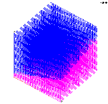

> Example 4: creatpts in a rectangular geometry that includes a material
> interface
>
> > The objective is to create  a rectangular mesh using the
> > **createpts/brick** command.
> >
> > A rectangular geometry is defined that contains a cut-plane defining
> > the boundary between two materials. The **createpts/brick** command
> > is used to create a point distribution within the geometry and a
> > nearest neighbor connectivity list. The output consists of one gmv
> > file.
>
> Input     
>
> > [lagrit\_input\_createbrick](../input_output/lagrit_input_createbrick)\
> >  
>
> Images of GMV output
>
> > [{width="168"
> > height="158"}](image/image4a.gif) [View A](image/image4a.gif)    
> > [{width="180"
> > height="174"}](image/image4b.gif) [View B](image/image4b.gif)
