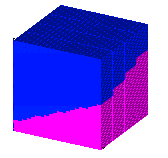
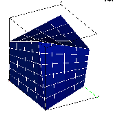

> Description: example createpts/brick
>
> > The objective is to add points to a mesh using the
> > **createpts/brick** command.  The **createpts/brick** command is
> > used to create a point distribution within a geometry. The output
> > consists of one gmv file for each example.
> >
> > **Individual Descriptions**\
> >  \
> >  
> >
> >   ------------------------------------------------------------------------ ------------------------------------------------------------------------
> >   [example 1](description4.html)  material interface\                      [example 2](description7.html)  brick mesh\
> >   [{width="168" height="158"}](description4.html)   [{width="164" height="167"}](description7.html)
> >   ------------------------------------------------------------------------ ------------------------------------------------------------------------
> >
