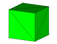

> Description: test dump
>
> > > The objective is to test the **dump** command for various file
> > > format options.\
> > >  \
> > > [Example 1](description_dump.html)
> > > [{width="114"
> > > height="89"}](description_dump.html)
