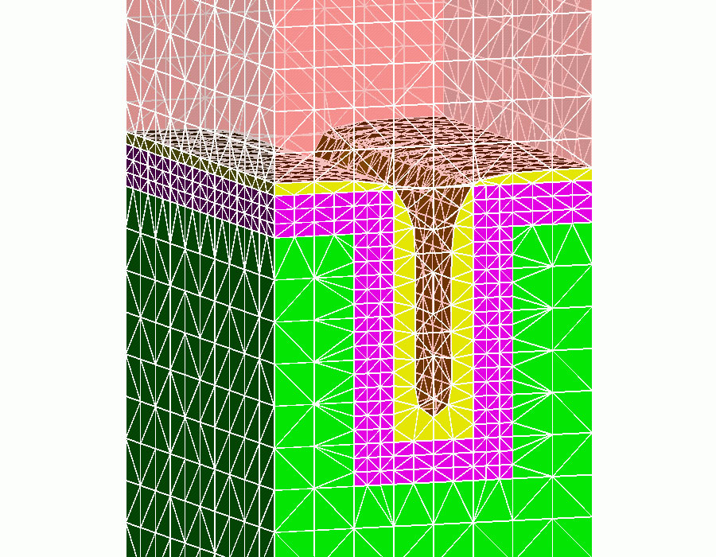
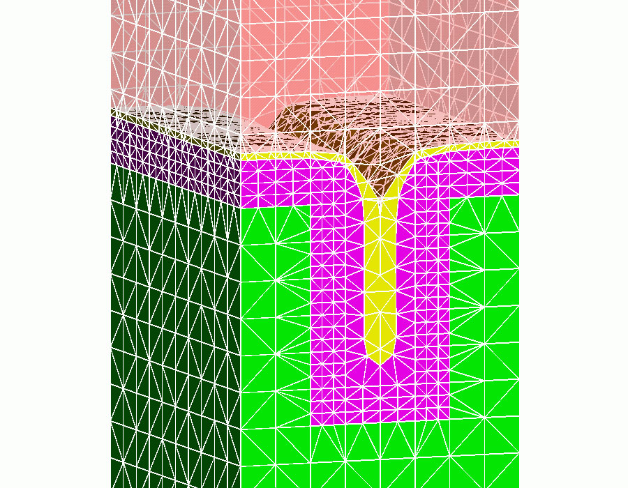
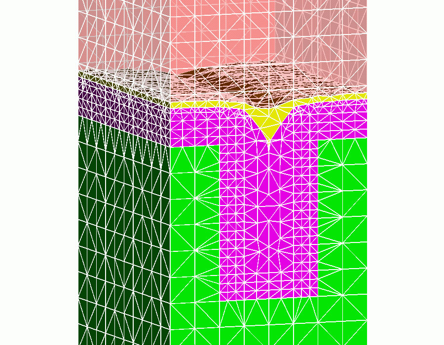

{.strut width="160"
height="1"}
[]{#content}
3D Grid Generation LaGriT
-------------------------

### Los Alamos Grid Toolbox

Geometry \
    Multiple Materials \
    Arbitrary Moving Interfaces/ Fronts  \
    Arbitrary Point Distribution \
    Unstructured/tet/hex/hybrid 

 

[{width="225"
height="175"}](images/trench4-0.jpg)

 

Adaption \
    Refinement/De-refinement \
    Smoothing/geometric/ field/function \
    Reconnection/Delaunay/geometric 

 

[{width="225"
height="175"}](images/trench4-4.jpg)

 

Interface \
    Toolbox Architecture \
    User Commands \
    User extensible grid Data Structures \
    Dynamic or Static Application 

 

[{width="225"
height="175"}](images/trench4-8.jpg)

 

Applications \
    Science Based Stockpile Stewardship \
    3D Grain Growth \
    Material Deposition/Etch \
    Oxidation \
    Diffusion \
    Electrostatics \
    Geologic Flow and Transport 

**Material Deposition**

{.strut width="420"
height="1"}

