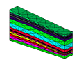

Example 1: convert a hexahedral grid into a tetrahedral grid

> The objective is to convert a given hex grid into a tet grid using
> **hextotet.**
> The output consists of one gmv file.

Input

> [lagrit\_input\_hextotet](../input_output/lagrit_input_hextotet)

Images of GMV input and output

[Output geometry {width="114"
height="89"}](image/output_tet.gif)

[Input geometry {width="114"
height="89"}](image/input_hex.gif)

{width="4" height="1"}

{width="46" height="1"}

{width="128" height="1"}

{width="33" height="1"}

{width="128" height="1"}

{width="517" height="1"}

> > 
> >
> >
