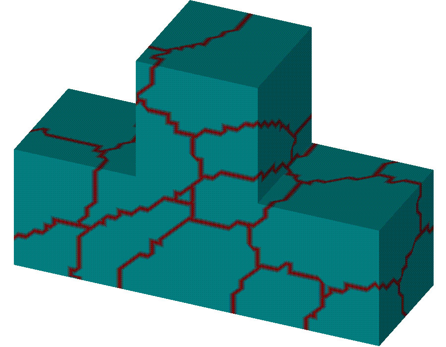
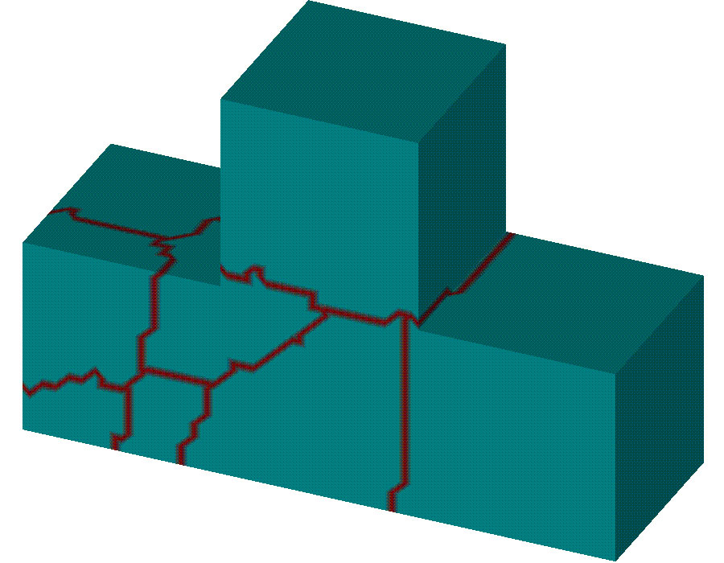
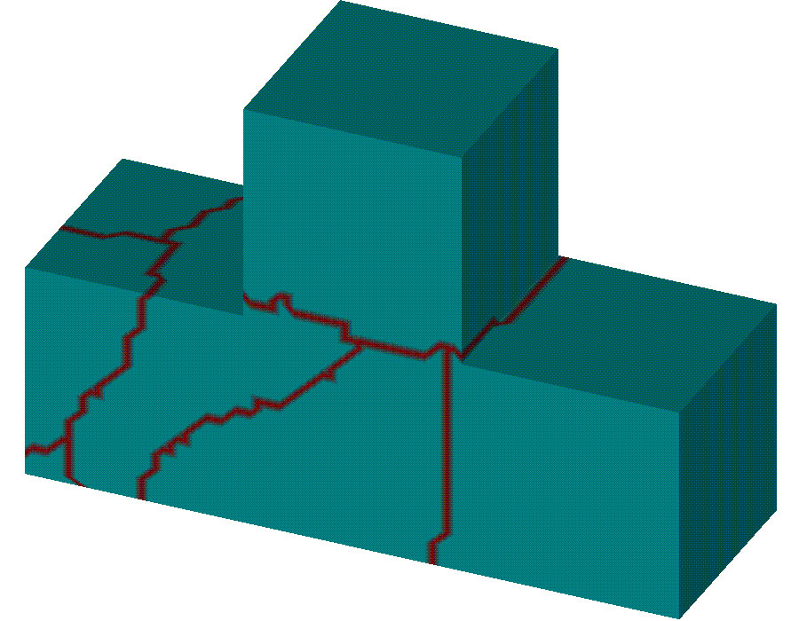
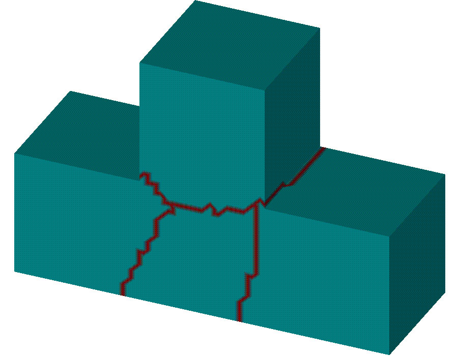
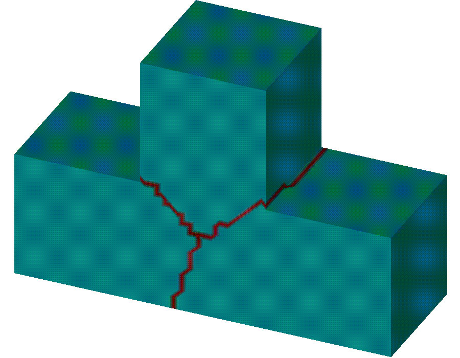
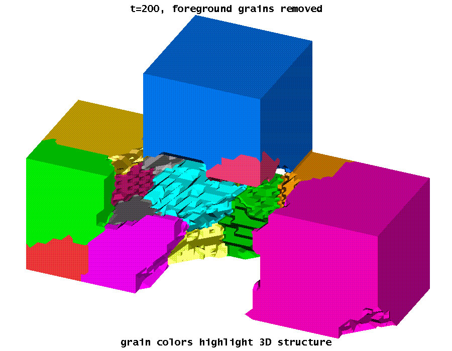
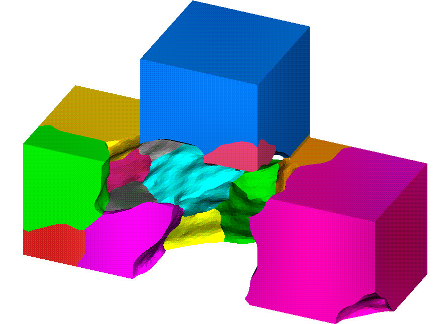
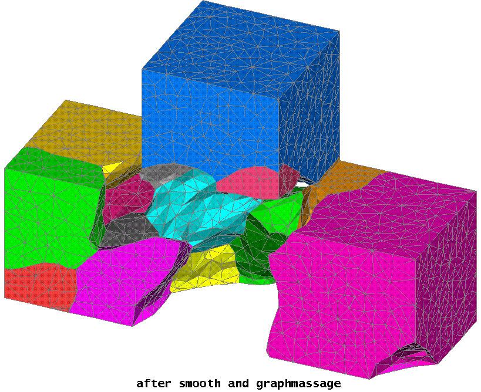
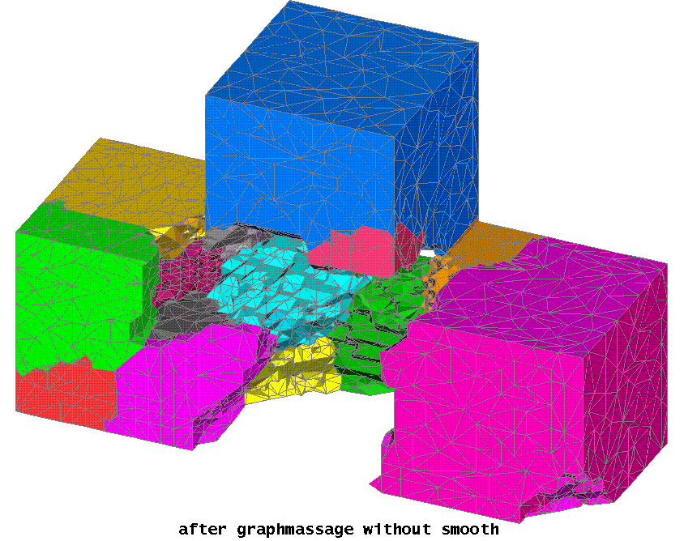

 ansparent.gif){.strut              Grain Evolution in a T-Junction   
 width="160" height="1"}            -------------------------------   

                                    #### by Tinka Gammel              

                                    Grain structure of a T-junction   
                                    obtained via Monte Carlo          
                                    evolution of a discrete effective 
                                    classical spin (Potts) model on   
                                    the nodes of the unstructured     
                                    tetrahedral grid generated by the 
                                    LANL LaGriT code for the bounding 
                                    geometry (taking advantage of     
                                    LaGriT's ability to efficiently   
                                    create and manipulate grids for   
                                    complex multimaterial geometries, 
                                    and for compatibility with our    
                                    finite element calculations). The 
                                    time unit is Monte Carlo sweeps   
                                    through the lattice. The          
                                    node-based Potts model needs      
                                    fewer neighbors to avoid          
                                    stagnation and also avoids grain  
                                    boundaries at topology-defining   
                                    nodes, which is numerically       
                                    convenient for using this result  
                                    as an initial condition for a     
                                    finite element continuum          
                                    calculation. The Potts model is   
                                    known to be the discrete analog   
                                    of curvature driven grain         
                                    boundary motion: the              
                                    irregularities in the grain       
                                    boundaries reflect the            
                                    discreteness. Note the T-junction 
                                    pins a grain boundary, preventing 
                                    annealing into a single grain.    

                                    +-------------------------------- 
                                    ---+----------------------------- 
                                    ------+                           
                                     {width=" 
                                    22  {widt 
                                    h="22                            
                                     5"                              
                                        5"                           

                                     height="175"}                   
                                        height="175"}                

                                     **T = 100**                     
                                        **T = 200**                  

                                    +-------------------------------- 
                                    ---+----------------------------- 
                                    ------+                           
                                     {width=" 
                                    22  {widt 
                                    h="22                            
                                     5"                              
                                        5"                           

                                     height="175"}                   
                                        height="175"}                

                                     **T = 300**                     
                                        **T = 400**                  

                                    +-------------------------------- 
                                    ---+----------------------------- 
                                    ------+                           
                                     {width=" 
                                    22  {widt 
                                    h="22                            
                                     5"                              
                                        5"                           

                                     height="175"}                   
                                        height="175"}                

                                     **T = 500**                     
                                        **T = 600**                  

                                    +-------------------------------- 
                                    ---+----------------------------- 
                                    ------+                           
                                     {width=" 
                                    22  {widt 
                                    h="22                            
                                     5"                              
                                        5"                           

                                     height="175"}                   
                                        height="175"}                

                                     **T = 700**                     
                                        **T = 800**                  

                                    +-------------------------------- 
                                    ---+----------------------------- 
                                    ------+                           
                                     {width=" 
                                    22  {widt 
                                    h="22                            
                                     5"                              
                                        5"                           

                                     height="175"}                   
                                        height="175"}                

                                     **T = 900**                     
                                        **T = 1000**                 

                                    +-------------------------------- 
                                    ---+----------------------------- 
                                    ------+                           
                                     {width=" 
                                    22                               

                                     5"                              

                                     height="175"}                   

                                     **(stagnated)**                 

                                    +-------------------------------- 
                                    ---+----------------------------- 
                                    ------+                           

                                    However, the result of the Potts  
                                    evolution on the unstructured     
                                    grid is artificially rough, even  
                                    at fairly high node density, as   
                                    seen in this close-up of the      
                                    t=200 microstructure. Fewer nodes 
                                    results in a rougher structure,   
                                    and more nodes becomes            
                                    computationally expensive.        

                                    {width=" 
                                    500"                              
                                    height="500"}                     

                                    Laplacian smoothing can reduce    
                                    the artificial roughness which is 
                                    an artifact of the Potts model    
                                    evolution. Here I show the same   
                                    t=200 snapshot after Laplacian    
                                    smoothing, using the "smooth"     
                                    command I recently contributed to 
                                    the LaGriT toolbox. This new      
                                    command will be included in the   
                                    next release (scheduled for       
                                    October, 1998) of LaGriT, and is  
                                    currently the only smooth         
                                    capability in LaGriT which works  
                                    on both the 2d surface meshes and 
                                    the 3d volume mesh while          
                                    preserving constrained            
                                    interfaces, like the outer        
                                    geometry of the "T" shown here.   
                                    Laplacian smoothing does not      
                                    however preserve volumes, but     
                                    acts in some sense similar to     
                                    mean-curvature motion in that it  
                                    will shrink spheres if used       
                                    iteratively. The version          
                                    implemented is under-relaxed, and 
                                    constrained not to invert the     
                                    volumes of the tetrahedra of the  
                                    mesh.                             

                                    {width 
                                    ="500"                            
                                    height="500"}                     

                                    LaGriT's "graphmassage"           
                                    capability can then be used to    
                                    reduce the node density and       
                                    produce a good grid for further   
                                    finite element computation. Here  
                                    I show the same t=200 snapshot    
                                    after massaging the smoothed      
                                    grid, removing in this case 6 out 
                                    of 7 nodes. The grid lines are    
                                    also shown.                       

                                    {w 
                                    idth="500"                        
                                    height="500"}                     

                                    Using LaGriT's "graphmassage"     
                                    without first smoothing the       
                                    structure does not yield as nice  
                                    a grid, as "graphmassage" is not  
                                    designed to smooth interfaces,    
                                    but rather to preserve their      
                                    character, as seen in the in the  
                                    picture below resulting from      
                                    "graphmassage" with the same      
                                    parameters, but without the       
                                    Laplacian smooth step. Smoothing  
                                    after graphmassage also compares  
                                    unfavorably to smoothing first,   
                                    and then using graphmassage, as   
                                    graphmassage with a small damage  
                                    tolerance will not remove surface 
                                    nodes on a rough interface, and   
                                    with a large tolerance can        
                                    introduce large-scale roughness.  

                                    {width 
                                    ="500"                            
                                    height="500"}                     

                                    {.strut             
                                    width="420" height="1"}           

