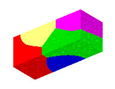
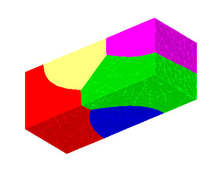
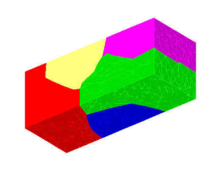
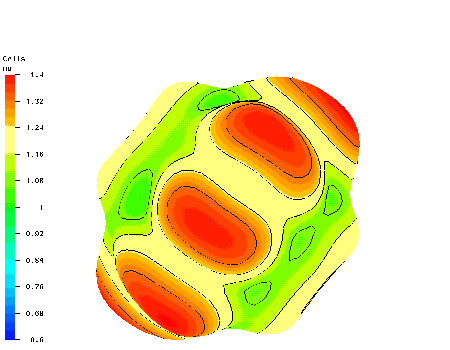

+-----------------------------------+-----------------------------------+
| ansparent.gif){.strut             | Pictures Created by Tinka Gammel  |
| width="160" height="1"}           | --------------------------------  |
|                                   |                                   |
|                                   | +-------------------------------- |
|                                   | ---+----------------------------- |
|                                   | ------+                           |
|                                   | | {wid |
|                                   | th | Initial (t=0) microstructure |
|                                   |  for  |                           |
|                                   | | ="225"                          |
|                                   |    | a  short metallic line used  |
|                                   | in    |                           |
|                                   | | height="175"}                   |
|                                   |    | the gradient-weighted finite |
|                                   |       |                           |
|                                   | |                                 |
|                                   |    | element calculations (b) and |
|                                   |  (c), |                           |
|                                   | | a                               |
|                                   |    | generated by discrete Potts  |
|                                   |       |                           |
|                                   | |                                 |
|                                   |    | evolution of random effectiv |
|                                   | e     |                           |
|                                   | |                                 |
|                                   |    | spins on the elements of the |
|                                   |       |                           |
|                                   | |                                 |
|                                   |    | tetrahedral LaGriT mesh foll |
|                                   | owed  |                           |
|                                   | |                                 |
|                                   |    | by a few timesteps of evolut |
|                                   | ion   |                           |
|                                   | |                                 |
|                                   |    | under mean curvature to remo |
|                                   | ve    |                           |
|                                   | |                                 |
|                                   |    | discrete artifacts.          |
|                                   |       |                           |
|                                   | +-------------------------------- |
|                                   | ---+----------------------------- |
|                                   | ------+                           |
|                                   | | {wi |
|                                   | dt | Microstructure at t=4 using  |
|                                   | mean  |                           |
|                                   | | h="225"                         |
|                                   |    | curvature grain boundary mot |
|                                   | ion.  |                           |
|                                   | | height="175"}                   |
|                                   |    |                              |
|                                   |       |                           |
|                                   | | b                               |
|                                   |    |                              |
|                                   |       |                           |
|                                   | +-------------------------------- |
|                                   | ---+----------------------------- |
|                                   | ------+                           |
|                                   | | {wi |
|                                   | dt | Microstructure at t=4 when a |
|                                   | n     |                           |
|                                   | | h="225"                         |
|                                   |    | orientation dependent grain  |
|                                   |       |                           |
|                                   | | height="175"}                   |
|                                   |    | boundary energy is used. Not |
|                                   | e     |                           |
|                                   | | c                               |
|                                   |    | that while the gross feature |
|                                   | s of  |                           |
|                                   | |                                 |
|                                   |    | (b) and (c) are the same, th |
|                                   | e     |                           |
|                                   | |                                 |
|                                   |    | mean curvature evolution in  |
|                                   | (b)   |                           |
|                                   | |                                 |
|                                   |    | accurately reproduces the    |
|                                   |       |                           |
|                                   | |                                 |
|                                   |    | well-known predictions for m |
|                                   | ean   |                           |
|                                   | |                                 |
|                                   |    | curvature motion (grains mee |
|                                   | ting  |                           |
|                                   | |                                 |
|                                   |    | at triple lines with 120 deg |
|                                   | ree   |                           |
|                                   | |                                 |
|                                   |    | angles, etc), whereasthe     |
|                                   |       |                           |
|                                   | |                                 |
|                                   |    | orientation dependent        |
|                                   |       |                           |
|                                   | |                                 |
|                                   |    | grainboundary energy used in |
|                                   |  (c)  |                           |
|                                   | |                                 |
|                                   |    | gives rise to the steps and  |
|                                   |       |                           |
|                                   | |                                 |
|                                   |    | facets expected for crytalli |
|                                   | ne    |                           |
|                                   | |                                 |
|                                   |    | metals such as Copper.       |
|                                   |       |                           |
|                                   | +-------------------------------- |
|                                   | ---+----------------------------- |
|                                   | ------+                           |
|                                   | | {wid |
|                                   | th | Orientation-dependence of th |
|                                   | e     |                           |
|                                   | | ="225"                          |
|                                   |    | grain boundary energy betwee |
|                                   | n     |                           |
|                                   | | height="175"}                   |
|                                   |    | grains 3 and 4 of Figure 1.  |
|                                   | The   |                           |
|                                   | |                                 |
|                                   |    | figure has the same orientat |
|                                   | ion   |                           |
|                                   | | d                               |
|                                   |    | as Figure 1. The direction t |
|                                   | o the |                           |
|                                   | |                                 |
|                                   |    | surface from the center is t |
|                                   | he    |                           |
|                                   | |                                 |
|                                   |    | direction of the grain bound |
|                                   | ary   |                           |
|                                   | |                                 |
|                                   |    | normal, and the length of th |
|                                   | e     |                           |
|                                   | |                                 |
|                                   |    | vector (and color of the sur |
|                                   | face) |                           |
|                                   | |                                 |
|                                   |    | gives the magnitude.  This   |
|                                   |       |                           |
|                                   | |                                 |
|                                   |    | surface is different for eac |
|                                   | h     |                           |
|                                   | |                                 |
|                                   |    | grain pair since it is a fun |
|                                   | ction |                           |
|                                   | |                                 |
|                                   |    | of their relative orientatio |
|                                   | ns as |                           |
|                                   | |                                 |
|                                   |    | well as the grain boundary n |
|                                   | ormal |                           |
|                                   | |                                 |
|                                   |    | dependence shown here. The   |
|                                   |       |                           |
|                                   | |                                 |
|                                   |    | interactionwith the boundary |
|                                   |  for  |                           |
|                                   | |                                 |
|                                   |    | this simulation was chosen t |
|                                   | o be  |                           |
|                                   | |                                 |
|                                   |    | grain and orientation        |
|                                   |       |                           |
|                                   | |                                 |
|                                   |    | independent. The grains have |
|                                   |  fcc  |                           |
|                                   | |                                 |
|                                   |    | symmetry and the parameters  |
|                                   | were  |                           |
|                                   | |                                 |
|                                   |    | chosen to approximate Copper |
|                                   | . We  |                           |
|                                   | |                                 |
|                                   |    | are currently investigating  |
|                                   | ways  |                           |
|                                   | |                                 |
|                                   |    | to more accurately model the |
|                                   |       |                           |
|                                   | |                                 |
|                                   |    | orientation dependence withi |
|                                   | n the |                           |
|                                   | |                                 |
|                                   |    | scope of the finite element  |
|                                   |       |                           |
|                                   | |                                 |
|                                   |    | calculation.                 |
|                                   |       |                           |
|                                   | +-------------------------------- |
|                                   | ---+----------------------------- |
|                                   | ------+                           |
|                                   |                                   |
|                                   | {.strut             |
|                                   | width="420" height="1"}           |
+-----------------------------------+-----------------------------------+

