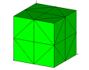
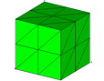

Example 1: Check quality of various meshes

> The objective is to use the **quality** command to interogate various
> mesh properties.
>
> There are three meshes tested in this example.
>
> The output consists of the result of the command output, placed into
> the output log file.

Input

[lagrit\_input\_qual1{width="114"
height="89"}](../input_output/lagrit_input_qual1)

> >  

[lagrit\_input\_qual1skew{width="114"
height="89"}](../input_output/lagrit_input_qual1skew)

> >  

[lagrit\_input\_qual2{width="114"
height="89"}](../input_output/lagrit_input_qual2)

> >  

Output

> [output\_qual1](../input_output/output_qual1)
>
> [output\_qual1skew](../input_output/output_qual1skew)
>
> [output\_qual2](../input_output/output_qual2)

{width="10" height="1"}

{width="10" height="1"}

{width="30" height="1"}

{width="135" height="1"}

{width="25" height="1"}

{width="150" height="1"}

{width="45" height="1"}

{width="200" height="1"}

{width="5" height="1"}

{width="252" height="1"}
