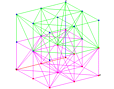

Example 1: define various point sets within a geometry

> The objective is to take a geometry with multiple materials and define
> various point sets using **pset.**
> The output consists of one gmv file, but the main effect is found by
> inspection of the output file.

Input

> [lagrit\_input\_pset](../input_output/lagrit_input_pset)

Images of GMV input and output

[Output log file](../input_output/output_pset)

[Input geometry {width="114"
height="89"}](image/pset2.gif)

{width="4" height="1"}

{width="46" height="1"}

{width="128" height="1"}

{width="33" height="1"}

{width="128" height="1"}

{width="517" height="1"}

> > 
> >
> >
