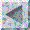

[{width="30"
height="30"}](mstkla.html#MODEL%20REGION:) [{width="30"
height="30"}](GeomEntity.html) [{width="30"
height="30"}](GeomFace.html)

{width="169" height="131"}

------------------------------------------------------------------------

------------------------------------------------------------------------

   **MODEL REGION OPERATORS:** 

------------------------------------------------------------------------

*void* **GR\_Faces**(*PGeomRegn* gr, *int* \*nf, *PGeomFace* \*faces);

Get the model faces that form the boundary of a model region.

------------------------------------------------------------------------

*int* **GR\_FaceDir**(*PGeomRegn* gr, *PGeomFace* gf);

Get the sense in which a model region is using a face, i.e., is the\
face normal pointing into the region (return value 0), out of the\
region (return value 1), both (return value 2) or none (return value\
-1). \*\*\*\*\* MUST VERIFY THiS WITH CODE VALUES \*\*\*\*\*\*

------------------------------------------------------------------------

*int* **GR\_OnBoundary**(*PGeomRegn* this, *PGeomEntity* gent);\
 \
 \
 

[{width="30"
height="30"}](mstkla.html#MODEL%20REGION:) [{width="30"
height="30"}](GeomEntity.html) [{width="30"
height="30"}](GeomFace.html)
