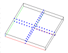

> Description: test rotatept
>
> > > The objective is to test the **rotatept** command.\
> > >  \
> > > [Example 1](description_rotatept.html)
> > > [{width="112"
> > > height="87"}](description_rotatept.html)
