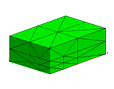
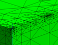

Example 1: test mesh edges and boundary faces for negative coupling
coefficients.\

> The objective is to use the **negative\_aij / rivara** command that
> first identifies elements that have negative coupling coefficents, and
> then proceeds with a rivara boundary refinement to reduce or eliminate
> the negative couplings.
>
> The output consists of one gmv file.

Input

> [lagrit\_input\_rivara](../input_output/lagrit_input_rivara)

Images of GMV input and output

> The details of the coupling coefficient statistics can be found in the
> output log file.

[Input geometry {width="114"
height="89"}](image/rivara1.gif)

[Output geometry](image/rivara2.gif)

[(view A){width="114"
height="89"}](image/rivara2.gif)

[Output geometry](image/rivara3.gif)

[(view B){width="114"
height="89"}](image/rivara3.gif)
