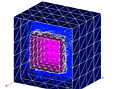
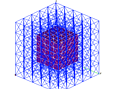
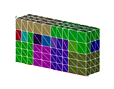
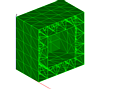
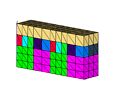

> Description: test addmesh
>
> > The objective is to join two meshes using the **addmesh** command,
> > excercising its various options. (add, amr, append, delete,
> > intersect, match, and merge) The test consists of seven examples
> > each exercising the **addmesh** using one of the mesh operations
> > **add**, **amr**, **append**, **delete**, **intersect**, **match**,
> > and **merge**. Each example has one gmv output file.
> >
> > Inidvidual Descriptions:\
> >  
> >
> >   ------------------------------------------------------------------------------------------------------ ------------------------------------------------------------------------------------------------------------------- -------------------------------------------------------------------------------------------------------
> >   [Example 1](description1_add.html)   **add**\                                                          [Example 2](description2_amr.html)  **amr**\                                                                        [Example 3](description3_append.html)  **append**\
> >   [{width="114" height="89"}](description1_add.html)           [{width="114" height="89"}](description2_amr.html)                        [{width="114" height="89"}](description3_append.html)
> >
> >    [Example 4](description4_delete.html)  **delete**\                                                    [Example 5](description5_intersect.html)  **intersect**\                                                            [Example 6](description6_match.html)  **match**\
> >   [{width="114" height="89"}](description4_delete.html)   [{width="114" height="89"}](description5_intersect.html)   [{width="114" height="89"}](description6_match.html)
> >
> >   [Example 7](description7_merge.html)  **merge**\                                                                                                                                                                           
> >   [{width="114" height="89"}](description7_merge.html)                                                                                                                          
> >   ------------------------------------------------------------------------------------------------------ ------------------------------------------------------------------------------------------------------------------- -------------------------------------------------------------------------------------------------------
> >
> > [Next Demo](../../../demos%0A/createpts/html/main_createpts1.html)
