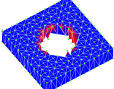

> Description: test rmmat
>
> > > The objective is to test the **rmmat** command.\
> > >  \
> > > [Example 1](description_rmmat.html)
> > > [{width="114"
> > > height="89"}](description_rmmat.html)
